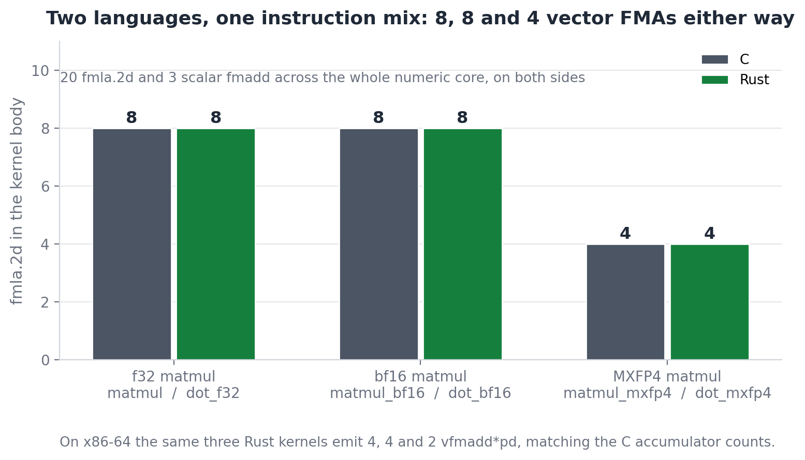

<div align="center">

<h1>kimi-k3-in-rust</h1>

<h3>A Rust port of <a href="https://github.com/FareedKhan-dev/kimi-k3-in-c">kimi-k3-in-c</a></h3>

<p>Kimi K3, 2.78 trillion parameters, on one CPU.<br>Byte-identical output to the C original, verified on the same machine.</p>

<p>
<a href="LICENSE"></a>
<a href="Cargo.toml"></a>
<a href="#platforms"></a>
<a href="#tests"></a>
<a href="#1-byte-identical-logits"></a>
</p>

</div>

> ### Read the original first
>
> **[FareedKhan-dev/kimi-k3-in-c](https://github.com/FareedKhan-dev/kimi-k3-in-c)** is where this
> engine comes from, and its README is the explanation: why a 2.78T model fits in 8 GB, what
> MXFP4 buys, how KDA and MLA and the attention-residual stack work, why the trunk streams,
> how the expert cache is sized, and the four reductions that take 5.56 TB down to a dial.
> All of that is unchanged here and is not repeated below.
>
> **This README covers only what is different in the Rust port.**

---

## Contents

- [What this is](#what-this-is)
- [Quick start](#quick-start)
- [Running it](#running-it)
- [What is different](#what-is-different)
  - [1. The numeric core carries explicit NEON and AVX2](#1-the-numeric-core-carries-explicit-neon-and-avx2)
  - [2. Scratch disjointness is enforced, not documented](#2-scratch-disjointness-is-enforced-not-documented)
  - [3. Tagged pointers became types](#3-tagged-pointers-became-types)
  - [4. The expert source is a trait, passed as an argument](#4-the-expert-source-is-a-trait-passed-as-an-argument)
  - [5. serde_json replaces the hand-written scanner](#5-serde_json-replaces-the-hand-written-scanner)
  - [6. rayon replaces OpenMP](#6-rayon-replaces-openmp)
  - [7. Errors are values, and aborts stay aborts](#7-errors-are-values-and-aborts-stay-aborts)
  - [8. Where the unsafe is](#8-where-the-unsafe-is)
  - [9. What is deliberately identical](#9-what-is-deliberately-identical)
  - [10. What is not ported](#10-what-is-not-ported)
- [How we know it is the same engine](#how-we-know-it-is-the-same-engine)
- [C against Rust, measured](#c-against-rust-measured)
- [Things the port turned up](#things-the-port-turned-up)
- [Size and shape](#size-and-shape)
- [Development](#development)
- [License and attribution](#license-and-attribution)

---

## What this is

A statement-for-statement port of the C99 engine at commit
[`ff11dce`](https://github.com/FareedKhan-dev/kimi-k3-in-c/commit/ff11dce858a2eb8a781224facdffd33a1fa48d25),
including the CLI, the test suite and the benchmark. Four dependencies: `libc`, `rayon`,
`serde`, `serde_json`. No BLAS, no framework, no GPU.

The engine's whole value is a numerical exactness contract - the same tokens at 8 GB and at
224 GB - so the port is judged by one question: does it produce the same bits? On this
machine it does, and [that is measured rather than asserted](#1-byte-identical-logits).

<a id="platforms"></a>
Platforms: Linux and macOS, x86-64 and arm64. O_DIRECT on Linux, `F_NOCACHE` on macOS,
buffered reads elsewhere. Windows compiles and runs through the buffered path.

## Quick start

```console
$ cargo test --release
...
GATE 1  teacher forcing : 32/32 positions match tf_pred
GATE 2  greedy decode   : 20/20 generated tokens match full_ids
GATE 3  incremental    : 20/20 generated tokens match full_ids
VERDICT: ENGINE MATCHES THE REFERENCE EXACTLY
...
test result: ok. 43 passed; 0 failed; 2 ignored
```

Three seconds, no weights, no network, no Python. The two ignored tests need the released
1.56 TB checkpoint; enable them with `K3_SHARD_DIR`.

```bash
cargo build --release        # target/release/k3
```

`[profile.release]` is `opt-level = 3` with `lto = "thin"`. There is no `target-cpu=native`
in the checked-in config, matching the original's `make portable` default. Opt in with
`RUSTFLAGS="-C target-cpu=native"`.

## Running it

The CLI surface is the original's, flag for flag, including exit codes and the wording of
every refusal. Anything the original's
[README](https://github.com/FareedKhan-dev/kimi-k3-in-c#usage) or
[QUICKSTART](https://github.com/FareedKhan-dev/kimi-k3-in-c/blob/main/docs/QUICKSTART.md)
says about invoking `k3` applies here:

```bash
k3 <model_dir> --trunk <packed_trunk> --preset laptop \
   --tok <model_dir> --prompt "The capital of France is" --gen 8 --incremental
```

Same presets (`auto`, `laptop`, `desktop`, `workstation`, `server`, `max`), same
`--incremental` / `--spec` / `--draft-trunk` decode paths, same `--save-state` /
`--load-state` on-disk format, same `k3_run.json`. `--help` is the source of truth.

The original's Python tooling works unchanged and is vendored in `tools/`: `tok_parity.py`
runs against the `k3-tok-test` binary this crate builds for exactly that purpose, and
`cmp_logits.py` against `--dump-logits` output. `scripts/download-model.sh` and
`scripts/pack-trunk.sh` live in the original and are not duplicated.

Two environment variables are new, and neither changes results:

| variable | effect |
|---|---|
| `RAYON_NUM_THREADS` | thread count, the `OMP_NUM_THREADS` analogue |
| `K3_EXPERT_LAYER` | which layer `tests/expert.rs` reads (default 1) |

`K3_NOHUGE`, `K3_NO_BATCH_PREFILL`, `K3_SHARD_DIR` and `K3_TOK_FILES` behave as they do in
the original.

---

## What is different

### 1. The numeric core carries explicit NEON and AVX2

This is the substantial change. The original has three paths that must agree bit for bit -
scalar, OpenMP and AVX2 - and it hand-writes the AVX2 intrinsics while leaving other
architectures to the compiler.

The port started with one generic body per kernel, stamped out under
`#[target_feature(enable = "avx2,fma")]`, on the theory that the fixed lane partition and
the explicit reduction tree were enough to keep the vectoriser honest. Two things went
wrong, and both are worth recording:

- **The x86-64 dispatch never compiled.** A `#[target_feature]` function can only be
  coerced to an *unsafe* function pointer, because calling one on a CPU without the feature
  is undefined behaviour. With safe `fn` pointers in the dispatch table the AVX2 arm failed
  to typecheck, and the only reason the crate still built is that the arm is behind
  `#[cfg(target_arch = "x86_64")]`. On an x86-64 host it would have been a compile error;
  had the types been looser it would have been a silent scalar fallback.
- **rustc did not vectorise where clang did.** The generic 16-accumulator body compiled to
  17 scalar `fmadd` on aarch64, against clang's 8 `fmla.2d` from the same algorithm.
  Removing bounds checks with `chunks_exact`, then fixed-size array references, then
  splitting the widening from the accumulation, all failed to move it.

So `src/ops/dispatch.rs` now holds three implementations of each hot kernel: a portable
body, an `avx2` module mirroring the original's intrinsics one for one, and a `neon` module
with the same lane mapping worked out for 2-lane `float64x2_t`. The dispatch table holds
`unsafe fn` pointers and is populated once behind a `LazyLock`, with `select()` the only
place that installs a feature-gated kernel and only after `is_x86_feature_detected!` agrees.

The lane algebra is in the module docs. For NEON the sixteen scalar accumulators become
eight vectors with `u[m] = (a[2m], a[2m+1])`, and the original's reduction tree
`b0 = (a0+a4)+(a8+a12)` falls out as `(u0+u2)+(u4+u6)` lanewise, associated in the same
order, so `vaddvq_f64` of that is exactly `b0+b1`. Same arithmetic, same rounding, same
bits - which the [logits comparison](#1-byte-identical-logits) then confirms end to end.



### 2. Scratch disjointness is enforced, not documented

The original threads one caller-owned `float *scratch` through every kernel and carves it
with pointer arithmetic. Its comments are emphatic about the hazard, and specific:

> Every region below is DISJOINT and must stay so. Overlapping any two of them can appear
> to work, aliasing the gate buffer onto q, say, is safe only while `H*vh < H*qh` holds, but
> that is an accident of the released dimensions, not an invariant.

The port carves the same regions in the same order with `split_at_mut`, so that comment
becomes a compile error instead of a warning. The offsets are unchanged; only the
enforcement is. The same applies to the MoE scratch, the KDA scratch and the decoder
layer's block-residual stack.

One consequence worth knowing: kernels the original calls with the same pointer twice
(`k3_rmsnorm(accL, accL, ...)`) get an explicit in-place variant here - `rmsnorm_ip`,
`kda_decay_ip`, `shortconv_ip` - documented as computing identically because the scale is
derived from the whole vector before any element is written.

### 3. Tagged pointers became types

The original stores a weight matrix as a `const void *` plus an `int wdt` tag, and opens
with a warning in capitals:

> ZERO-INITIALISE EVERY WEIGHT STRUCT BEFORE FILLING IT. An uninitialised stack struct
> therefore does not merely read wrong weights, it jumps to a garbage address.

Here that is:

```rust
pub enum WMat<'a> { F32(&'a [f32]), Bf16(&'a [u16]), I8R(&'a [u8]) }
```

and the "exactly one of `kda`/`mla` is non-NULL" rule is an `enum Attn`. The `memset`-first
discipline is not a rule the reader has to remember, and the tag cannot disagree with the
pointer. `Option<WMat>` carries the NULL-selects-a-path cases (dense versus MoE, gated
versus ungated MLA) explicitly.

### 4. The expert source is a trait, passed as an argument

`K3ExpertSrc` is a struct of function pointers stored inside `K3MoeW`, which the MoE kernel
then calls through - so a read-only weight struct owns a mutable cache. The port makes it a
trait object threaded as its own parameter:

```rust
fn moe(..., w: &MoeW, ..., src: Option<&mut dyn ExpertSrc>)
```

`get` returns `Option<ExpertQ<'_>>`, borrowing the source, which is exactly the original's
documented contract ("must leave the returned pointers valid until the caller finishes")
now expressed in the signature. `get_many` and `resident` are default methods, so the
"may be NULL, and callers MUST cope" comment becomes the default implementation.

### 5. serde_json replaces the hand-written scanner

The original hand-rolls a JSON scanner (`third_party/json.h`) and an FNV-1a open-addressed
hash table over 497,220 tensor names. The port uses `serde_json` and `HashMap`.

This is strictly safer in one respect the original notes about itself: its parser stores
numbers as `double`, which is exact only below 2^53, and safetensors offsets are byte
counts into a 1.56 TB file. `serde_json` gives `i64`. Observable behaviour is otherwise
identical - duplicate tensor names still hard-error, absent names still return `None`, the
shard scan is still in sorted filename order - and `tests/st.rs` asserts the same six named
tensors the original's Makefile does.

The one behaviour not reproduced: the C scanner turns non-ASCII `\uXXXX` escapes into `?`.
No tensor name in the checkpoint or the fixtures has one.

### 6. rayon replaces OpenMP

Legal for the same reason the original gives for OpenMP: every parallel loop writes only its
own output element, and the accumulation order *inside* a row is untouched, so results are
identical at any thread count. The `if (out > 64)` serial thresholds on the pragmas are kept
as explicit branches. `RAYON_NUM_THREADS` stands in for `OMP_NUM_THREADS`.

The expert cache's three-phase batch prefetch keeps its shape: serial reserve marking slots
INFLIGHT, parallel reads sorted by `(shard, offset)`, serial publish of only the reads that
completed. The parallel phase writes into distinct slots of one arena through a small
`SlotWriter`, and the safety argument the original makes in a comment is attached to the
`unsafe` block here.

### 7. Errors are values, and aborts stay aborts

Library functions return `std::io::Result`. But where the original deliberately calls
`abort()`, the port panics with the same message, because the reasoning transfers exactly:

> These kernels return void, so a failed allocation could only be handled by returning
> early, which leaves the output buffer holding whatever was in it before, and the caller
> consumes it as a result. The run then completes and prints a plausible token computed
> from uninitialised memory.

So `k3_fatal_oom` and `k3_fatal_bound` become panics carrying the original text, and the
MLA KV-cache bound check is still a hard stop rather than a `Result`. Rust's allocator
aborts on OOM by itself. A dropped routed expert is still counted rather than fatal, and
still exits 4, because that decision belongs to the caller.

### 8. Where the unsafe is

65 uses of the keyword, concentrated where the original is doing something the borrow
checker cannot see:

| module | uses | what |
|---|---|---|
| `bind.rs` | 15 | reinterpreting a layer blob's bytes as `&[f32]` / `&[u16]` at recorded offsets |
| `ops/dispatch.rs` | 14 | the NEON and AVX2 intrinsics, plus the `unsafe fn` dispatch table |
| `io_util.rs` | 10 | the aligned/hugepage allocator, `O_DIRECT`, `F_NOCACHE`, `madvise` |
| `main.rs` | 7 | `getrusage`, and the state file's raw header layout |
| `trunk.rs` | 7 | the ring arena the reader thread writes while the main thread computes |
| `ops/mod.rs` | 6 | calling through the dispatch table |
| `cache.rs` | 4 | the parallel phase of the batch prefetch |
| `st.rs` | 2 | positioned reads into an aligned buffer |

Every block has a safety comment. The allocator is the only place that owns raw memory;
everything else borrows from it.

### 9. What is deliberately identical

Not "similar" - identical, and tested:

- **Every reduction order.** The 16-lane and 8-lane partitions, the `(b0+b1)+(b2+b3)` trees,
  and the tail loops. `fma(a,b,c)` is `a.mul_add(b, c)`; a plain `a*b + c` stays two
  operations. Never one where the original has the other.
- **Every cast point.** `sc[s] = (float)d * scale` narrows before the f32 multiply here too.
- **The E8M0 and E2M1 tables**, including the low-nibble-is-even convention and 255-is-zero.
- **The three model invariants**, each restated at its point of use: `A_log` per head, NoPE
  slots retained and cached, routing bias steering selection only.
- **The tokenizer**, down to the GPT-2 `byte2str` map being built before any key, the
  `rankbpe = 1` merge rule, and the Kimi pretokenizer's leading-Han-run rule. The two
  unicode classification tables are transcribed entry for entry rather than swapped for a
  crate, because parity is byte-for-byte.
- **The on-disk state format** (`"K3ST"`, version 1), the `k3_run.json` shape, the cache
  histogram JSON and the `(layer, expert)` trace.
- **The fixtures**, copied verbatim from the original's `tests/fixtures/`.

### 10. What is not ported

- The original's `docs/` prose and its `docs/data/` captures. Those are its measurements on
  its hardware; re-hosting them here would imply this port produced them. Links instead.
- The three I/O timing regimes in `test_expert.c` (sequential cold, random cold, warm). They
  need `/proc/sys/vm/drop_caches` and root, and they measure the storage device.
- The 93-layer conformance sweep and the torch comparison harness, which need the checkpoint
  and a PyTorch install. `tests/expert.rs` and `tests/real_layer.rs` are the checkpoint-gated
  equivalents.
- Scope limits are unchanged and are the original's: no chat template, greedy only, no
  chunked prefill, no vision tower, no quality benchmark.

---

## How we know it is the same engine

<a id="tests"></a>


### 1. Byte-identical logits

The strongest check. The tiny-model oracle's final-position logits, dumped from both
binaries on this machine and compared with `cmp`:

```console
$ cd ~/Dev/kimi-k3-in-c && K3_DUMP_LOGITS=/tmp/c_logits.bin ./bin/k3_model tests/fixtures
VERDICT: ENGINE MATCHES THE REFERENCE EXACTLY
dumped 256 final-position logits to /tmp/c_logits.bin

$ cd ~/Dev/kimi-k3-in-rust && cargo test --release --test model_oracle
VERDICT: ENGINE MATCHES THE REFERENCE EXACTLY
logits dumped to target/rust_logits.bin

$ cmp /tmp/c_logits.bin target/rust_logits.bin && echo IDENTICAL
IDENTICAL
```

256 f32, 1024 bytes, no difference. The C side needed a two-line patch to dump the vector;
that patch is not committed to the original.

### 2. The three oracle gates

13 layers, hidden 128, vocab 256 - thirteen because attention residuals work in blocks of
twelve and their failure modes need two complete blocks and a third in progress. All three
gates exact, and the same verdict from the C binary on the same fixtures:

```text
GATE 1  teacher forcing : 32/32 positions match tf_pred
        generated span  : 20/20  <- must be exact
GATE 2  greedy decode   : 20/20 generated tokens match full_ids
GATE 3  incremental    : 20/20 generated tokens match full_ids  <- KV cache + carried KDA state
```

### 3. The kernel fixtures

18 tests over the original's fixture set, with tolerances read from its `MANIFEST.json` and
a skip counted as a failure, as it is there. Two exactness tests replace what the original
got from its `#ifdef` matrix: `matmul_bf16` against `matmul` on synthetic data compared with
`to_bits`, and each dispatched kernel against a reference dot product written in the test
that reproduces the lane partition and tree independently.

### 4. Codegen parity

Same instruction mix as the original on this machine, because the lane mappings match:

```text
aarch64, fmla.2d per kernel        x86-64, vfmadd*pd per kernel
kernel          C     Rust         kernel          C     Rust
matmul          8     8            matmul          4     4
matmul_bf16     8     8            matmul_bf16     4     4
matmul_mxfp4    4     4            matmul_mxfp4    2     2
total          20    20
scalar fmadd    3     3
```

---

## C against Rust, measured

Both builds on one machine (Apple M5, 10 cores), at their real settings: C with
`clang -O3 -mcpu=native -ffp-contract=off` and OpenMP through libomp, Rust with
`opt-level = 3`, thin LTO and rayon. Thread count pinned per run with `OMP_NUM_THREADS` and
`RAYON_NUM_THREADS`. Every number is the median of five runs of a benchmark that itself does
one warm call plus five timed ones. Raw data: [`docs/data/perf-sweep.csv`](docs/data/perf-sweep.csv).

**The two builds are shown to be doing the same work first.** Both benchmarks fill inputs
from the same xorshift32 with the same seeds, and hashing the output vectors gives
`6c14a49941ce86d9` (bf16) and `a231061237b5579d` (mxfp4) on both sides. Without that check a
timing comparison is comparing two workloads.


```text
                     one core                    all 10 cores
bf16 matmul   C  18.58 ms   9.5 GFLOP/s     C  4.33 ms  40.7 GFLOP/s
12288 x 7168  R   9.21 ms  19.1 GFLOP/s     R  1.81 ms  97.2 GFLOP/s    Rust 2.0x / 2.4x

MXFP4 matmul  C   2.39 ms   9.2 GFLOP/s     C  0.56 ms  39.4 GFLOP/s
3072 x 3584   R   2.42 ms   9.1 GFLOP/s     R  0.57 ms  38.6 GFLOP/s    a tie
```

MXFP4 ties, which is what an identical instruction mix predicts. bf16 is about 2x faster in
Rust and **is already 2x at one core**, so it is not a threading effect:


Neither threading runtime is the story. Both scale the same way and both flatten past six
cores, which is the memory-bandwidth wall this engine is designed around:


So where does the bf16 2x come from, when both kernels issue exactly 8 `fmla.2d`? The bf16
unpack. Disassembling the two kernel bodies:


```text
                        load   bf16->f32   f32->f64   vector FMA   total
C    k3_matmul_bf16       20          16         16            8      60
Rust neon::dot_bf16        7           4         16            8      35
```

The arithmetic is identical: 8 vector FMAs and 16 lanes of `f32 -> f64` widening either way.
The whole difference is getting bf16 values into registers. From the C source's scalar
`k3_bf16f()` expression clang emitted 2-lane `shl.2s` shifts with per-halfword `mov.h`
inserts fed by a deinterleaving `ld2.2s`; the hand-written NEON does one `shll.4s` per four
elements off a plain `ldp`.

**This is not "Rust is faster than C."** It is that the original hand-wrote AVX2 and left
aarch64 to the autovectoriser, which picked a poor unpack on one kernel. The same intrinsics
in C would close it. What the measurement does establish is that the port carries no
overhead on the hot path - identical arithmetic, and the one divergence traceable to a single
instruction-selection choice.

One caveat, because these numbers are easy to over-read. End to end on the 13-layer tiny
model, single-threaded, C is faster: 0.166 s against 0.312 s. At hidden size 128 the
per-call dispatch overhead dominates the arithmetic completely, and both builds are
pathological there - with 10 threads each takes over a second, seven times worse than one.
The kernel benchmark above runs at the real model's dimensions, which is the regime that
matters.

---

## Things the port turned up

Findings worth passing back upstream:

1. **`bench_kernels.c` uses a truncated FNV offset basis.** It carries
   `1469598103934665603`; the FNV-1a 64-bit basis is `14695981039346656037`, one digit
   longer. The hash is still a perfectly good fingerprint, but it is not FNV-1a. The Rust
   benchmark prints both so its output can still be diffed against the original's.
2. **The `#[target_feature]` dispatch trap.** Documented in
   [section 1](#1-the-numeric-core-carries-explicit-neon-and-avx2) because anyone
   multiversioning kernels in Rust will hit it.
3. **Three bugs in this port's own generated tests**, all found by running them and all
   fixed by trusting the C source over the test: an `l2norm` expectation that divided by
   `sqrt(5)` where its own comment said 25; a `kda_layer` state comparison that used the
   buffer length instead of the fixture's, where the original compares the fixture's; and a
   `layer_kda` case that left the KDA gate weight unwired because `g` and `o` are shared
   struct fields. Recorded because "the test was wrong" is the failure mode that quietly
   erodes a suite.

---

## Size and shape

```text
                      Rust        C        note
engine source        9,271    5,676        excluding the vendored tokenizer
vendored tokenizer   3,402    1,122        BPE + two transcribed unicode tables
tests and benches    4,582        -        9 test binaries plus the kernel benchmark
binary             1.16 MB   176 KB        Rust links its std; C links libc dynamically
dependencies             4        2        libc/rayon/serde/serde_json vs libm/OpenMP
```


The line count is up about 60% on the engine. Roughly: three kernel implementations where
the original has two, `split_at_mut` chains where the original does pointer arithmetic, and
the unicode tables formatted one entry per line. None of it is abstraction.


## Development

```bash
cargo test --release       # 43 tests, no weights, no network, no Python
cargo bench                # the kernel benchmark, same shapes as the C one
cargo clippy --all-targets # zero warnings
cargo fmt
K3_SHARD_DIR=/path cargo test --release -- --ignored   # the two checkpoint-gated tests
```

[`docs/images/`](docs/images/) holds the figure set with the Python and Mermaid generators
that produce it, and its README separates the figures measured here from the ones inherited
from the original.

## License and attribution

Apache 2.0, see [`LICENSE`](LICENSE).

This is a derivative work of
[FareedKhan-dev/kimi-k3-in-c](https://github.com/FareedKhan-dev/kimi-k3-in-c), which is
Apache 2.0 and is the source of the algorithm, the test fixtures, the vendored tokenizer and
the figure generators. [`NOTICE`](NOTICE) carries its attribution and the third-party
declarations.

Kimi K3 is created and released by Moonshot AI under its own license. This repository
contains **no model weights** and grants no rights to them.
