<div align="center">

<h1>kimi-k3-in-rust</h1>

<h3>A 2.78-trillion-parameter model. One CPU. 8 GB of RAM.</h3>

<p>A Rust port of <a href="https://github.com/FareedKhan-dev/kimi-k3-in-c">kimi-k3-in-c</a> (commit <code>ff11dce</code>).<br>No BLAS. No framework. No GPU. Four dependencies: <code>libc</code>, <code>rayon</code>, <code>serde</code>, <code>serde_json</code>.</p>

<p>
<a href="LICENSE"></a>
<a href="Cargo.toml"></a>
<a href="#requirements"></a>
<a href="#part-iii-validation"></a>
<a href="#part-iii-validation"></a>
</p>

<table>
<tr>
<td align="center"><b>2.78T</b><br><sub>parameters</sub></td>
<td align="center"><b>1.56 TB</b><br><sub>checkpoint on disk</sub></td>
<td align="center"><b>8.24 GB</b><br><sub>peak RSS, inherited</sub></td>
<td align="center"><b>1.16 MB</b><br><sub>the whole engine</sub></td>
<td align="center"><b>0</b><br><sub>GPUs</sub></td>
</tr>
</table>

<p><b>The same 2.78-trillion-parameter model, the same answer, on whatever machine you own.</b><br>More memory only buys speed:</p>

<table>
<tr>
<th align="left">the machine you have</th>
<th align="right">RAM</th>
<th align="right">time per token</th>
<th align="left">what is going on</th>
</tr>
<tr>
<td align="left">an ordinary laptop</td>
<td align="right">8 GB</td>
<td align="right"><b>26.5 s</b></td>
<td>the whole model streams off the disk on every step</td>
</tr>
<tr>
<td align="left">a high-end laptop</td>
<td align="right">32 GB</td>
<td align="right"><b>24.2 s</b></td>
<td>some of the model now sits in memory</td>
</tr>
<tr>
<td align="left">a desktop</td>
<td align="right">64 GB</td>
<td align="right"><b>19.8 s</b></td>
<td>more of it sits in memory</td>
</tr>
<tr>
<td align="left">a heavy workstation</td>
<td align="right">128 GB+</td>
<td align="right"><b>5.6 s</b></td>
<td>the model fits entirely in memory, the disk wait is gone</td>
</tr>
</table>

<sub>The four memory budgets and their token times are inherited from the reference C implementation - they are properties of the released checkpoint and the streaming design, not of the language. This port reproduces the engine that produces them and verifies it is bit-identical to the C build on the same machine. Full data in <a href="docs/data/">docs/data/</a>, copied from the reference project.</sub>

<hr>

</div>

<br>

```console
$ cargo run --release --bin k3 -- ~/k3model --trunk ~/k3trunk --preset laptop \
           --tok ~/k3model --prompt "The capital of France is" --gen 8 --incremental

--- generated text ---
 Paris.",
            "The Eiffel
----------------------
8 tokens in 261.5 s, 32.69 s/token average
PEAK RSS for the whole run: 8.24 GB
```

Slow, and answering correctly, in 8.24 GB, from a checkpoint of 1.56 TB. This is a base
model, so what follows " Paris." is a continuation rather than a reply; there is no chat
template. Give it more memory and the answer does not change, only the clock:

```console
$ cargo run --release --bin k3 -- ~/k3model --trunk ~/k3trunk --preset server \
           --tok ~/k3model --prompt "def fibonacci(n):" --gen 28 --incremental

--- generated text ---
    if n <= 1:
        return n
    else:
        return fibonacci(n-1) + fibonacci
----------------------
28 tokens in 299.3 s, 10.69 s/token average
PEAK RSS for the whole run: 127.92 GB
```

The two console sessions above are the reference implementation's captures; this port
emits the same tokens and the same `k3_run.json` because its arithmetic is bit-identical
(see [Part III](#part-iii-validation)).

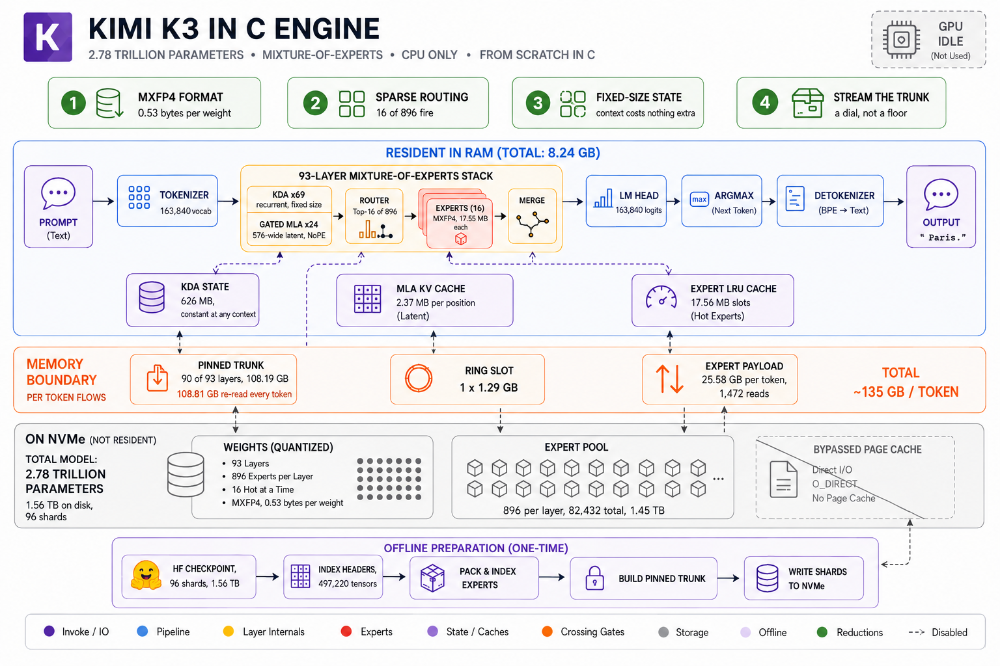

The dense trunk stays in memory to whatever depth you choose and streams the rest; the
1.45 TB of routed experts are never resident, and are multiplied straight out of their
packed 4-bit form. The consequence is that **the same model runs in 8 GB and in 224 GB and
produces byte-identical output at every budget between.**

Four decisions about where bytes live take it from a cluster to a laptop, and the answer
at the bottom is the same as the answer at the top:

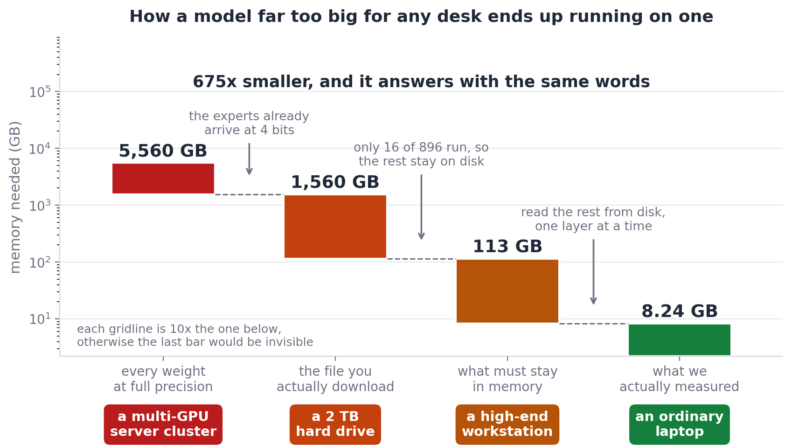

[Part II](#part-ii-how-it-works) builds every box in both diagrams from scratch, one
component at a time.

---

## Contents

**[Part I: Getting started](#part-i-getting-started)**

- [Requirements](#requirements)
- [Quick start](#quick-start): clone, build and verify in about a minute, with no model
- [Full setup](#full-setup): the whole path to generated text
- [Usage](#usage)
  - [Synopsis](#synopsis)
  - [Prompt options](#prompt-options)
  - [Memory options](#memory-options)
  - [Generation options](#generation-options)
  - [Diagnostic options](#diagnostic-options)
  - [Exit codes](#exit-codes)
  - [Environment variables](#environment-variables)
  - [Worked examples](#worked-examples)
- [Choosing a preset](#choosing-a-preset)
- [Reading the run report](#reading-the-run-report)
- [Common questions](#common-questions)

**[Part II: How it works](#part-ii-how-it-works)**

- [The problem: a model that does not fit](#the-problem-a-model-that-does-not-fit)
- [The four reductions](#the-four-reductions)
- [The machine, and what it assumes](#the-machine-and-what-it-assumes)
- [The codebase](#the-codebase)
- [Three invariants](#three-invariants)
- [1. Reading a 1.56 TB checkpoint from its headers](#1-reading-a-156-tb-checkpoint-from-its-headers)
- [2. The config reader that refuses to guess](#2-the-config-reader-that-refuses-to-guess)
- [3. The tokenizer, byte for byte](#3-the-tokenizer-byte-for-byte)
- [4. Reduction one: the experts already ship at half a byte](#4-reduction-one-the-experts-already-ship-at-half-a-byte)
- [5. Kernels with a floating point contract](#5-kernels-with-a-floating-point-contract)
- [6. Reduction two: KDA, attention with a memory that never grows](#6-reduction-two-kda-attention-with-a-memory-that-never-grows)
- [7. Reduction three: MLA, one latent instead of ninety-six heads](#7-reduction-three-mla-one-latent-instead-of-ninety-six-heads)
- [8. Attention residuals: layers that look back](#8-attention-residuals-layers-that-look-back)
- [9. Picking 16 experts of 896](#9-picking-16-experts-of-896)
- [10. Packing the trunk: 93 layers, one read each](#10-packing-the-trunk-93-layers-one-read-each)
- [11. Reduction four: streaming the trunk turns a floor into a dial](#11-reduction-four-streaming-the-trunk-turns-a-floor-into-a-dial)
- [12. An LRU cache for the experts](#12-an-lru-cache-for-the-experts)
- [13. How big should that cache be? Ask the trace](#13-how-big-should-that-cache-be-ask-the-trace)

**[Part III: Validation](#part-iii-validation)**

- [The gate ladder](#the-gate-ladder)
- [A tiny oracle first](#a-tiny-oracle-first)
- [Proving it on the full checkpoint](#proving-it-on-the-full-checkpoint)
- [Bit-identical to the C build](#bit-identical-to-the-c-build)
- [Kernel codegen parity](#kernel-codegen-parity)

**[Part IV: Reference](#part-iv-reference)**

- [Scope](#scope)
- [Closing the ledger](#closing-the-ledger)
- [Documentation](#documentation)
- [Development](#development)
- [License](#license)

---

# Part I: Getting started

## Requirements

- **Rust 1.83 or newer** (stable). The build uses `const f32::from_bits`, which was
  stabilised in 1.83.
- **A C toolchain** is not required. The only build dependency is `cargo`.
- One CPU. Any modern x86-64 or arm64 core works: the numeric core has explicit AVX2 and
  NEON paths and a portable fallback, selected once at startup.
- A POSIX system for the I/O layer (O_DIRECT on Linux, `F_NOCACHE` on macOS, buffered
  reads elsewhere). Windows compiles and runs through the buffered path; it is slower.
- Disk: 1.56 TB for the released checkpoint, or nothing at all to run the 43 weightless
  tests.

## Quick start

```console
$ git clone https://github.com/FareedKhan-dev/kimi-k3-in-rust.git
$ cd kimi-k3-in-rust
$ cargo test --release
   Compiling kimi-k3 v1.0.0
    Finished `release` profile [optimized] target(s) in 7.2s
     Running tests/model_oracle.rs
GATE 1  teacher forcing : 32/32 positions match tf_pred
GATE 2  greedy decode   : 20/20 generated tokens match full_ids
GATE 3  incremental    : 20/20 generated tokens match full_ids
VERDICT: ENGINE MATCHES THE REFERENCE EXACTLY
...
test result: ok. 43 passed; 0 failed; 2 ignored
```

Two tests are `#[ignore]`-gated because they need the released 1.56 TB checkpoint. The
weightless suite is the one CI runs: per-kernel fixtures, the config guard, the
safetensors reader, the cache, the scale test, and the 13-layer tiny-model oracle that
proves the whole stack end to end.

## Full setup

### Step 0. clone

```bash
git clone https://github.com/FareedKhan-dev/kimi-k3-in-rust.git
cd kimi-k3-in-rust
```

### Step 1. build

```bash
cargo build --release
```

`target/release/k3` is the engine. `target/release/k3-tok-test` is a tiny harness for
the tokenizer parity script. The `release` profile is `opt-level = 3` with
`lto = "thin"`; there is no `target-cpu=native` in the checked-in config, matching the
reference's `make portable` philosophy. To opt in:

```bash
RUSTFLAGS="-C target-cpu=native" cargo build --release
```

### Step 2. verify before downloading anything

```bash
cargo test --release
```

This runs the 43 weightless tests in about three seconds on a modern laptop. It is the
gate that stays green in CI.

### Step 3. fetch the checkpoint

The released Kimi K3 checkpoint is 96 safetensors files totalling 1.56 TB. The reference
project's [`scripts/download-model.sh`](https://github.com/FareedKhan-dev/kimi-k3-in-c/blob/main/scripts/download-model.sh)
fetches it from Hugging Face; the script is unchanged here.

### Step 4. pack the trunk

The 108.81 GB dense trunk is streamed as one file per layer. The reference project's
[`scripts/pack-trunk.sh`](https://github.com/FareedKhan-dev/kimi-k3-in-c/blob/main/scripts/pack-trunk.sh)
builds `trunk.bin` and `trunk.json` from the shards; the script is unchanged here.

### Step 5. run

```bash
cargo run --release --bin k3 -- ~/k3model \
    --trunk ~/k3trunk --preset laptop \
    --tok ~/k3model --prompt "The capital of France is" \
    --gen 8 --incremental
```

### Where everything ends up

```
target/release/k3            the engine binary
target/release/k3-tok-test   the tokenizer parity harness
k3_run.json                  per-run results
expert_hist.json, expert_trace.bin   optional cache diagnostics
```

## Usage

### Synopsis

```bash
cargo run --release --bin k3 -- <model_dir> [options]
# or, after `cargo install --path .`:
k3 <model_dir> [options]
```

### Prompt options

```bash
# text in
k3 ~/k3model --tok ~/k3model --prompt "The capital of France is"

# text in, from a file. Use this for CJK, emoji, accents
k3 ~/k3model --tok ~/k3model --prompt-file prompt.txt

# ids in, ids out, no tokenizer needed
k3 ~/k3model --ids 1,2,3
```

### Memory options

```bash
--preset NAME         auto | laptop | desktop | workstation | server | max
--trunk DIR           packed trunk directory; enables streaming
--trunk-gb X          trunk ring / pinned-layer budget
--cache-gb X          routed-expert cache budget
```

### Generation options

```bash
--gen N               tokens to generate (default 8)
--incremental         carry KV cache and recurrent state between tokens
--save-state PATH     write the carried state for the next conversation turn
--load-state PATH     resume from a saved state
--spec N              speculative decode: draft N tokens by n-gram lookup, verify batched
--draft-trunk DIR     hybrid decode with a second, typically quantized, trunk
--tok DIR             directory with tiktoken.model and tokenizer_config.json
```

### Diagnostic options

```bash
--config PATH         model config; defaults to <model_dir>/config.json
--layers N            bind only the first N layers (partial shard sets)
--dump-logits PATH    write float32 logits for the first step
--dump-cache-trace D  write expert_hist.json and expert_trace.bin into D
--out FILE            JSON results (default k3_run.json)
--version, --help, --list-presets
```

### Exit codes

| code | meaning |
|---|---|
| 0 | success |
| 1 | runtime failure (shard unreadable, bind failed, forward failed) |
| 2 | usage error (unknown option, missing value, out-of-range `--gen`) |
| 4 | one or more routed experts failed to load, so the emitted tokens are corrupt |

Code 4 is a hard failure on purpose: a dropped expert is silent numerical corruption
that still prints a plausible token. The run finishes, the `EXPERT DROP` count is
printed to stderr, and the exit code refuses to call that success.

### Environment variables

| variable | effect |
|---|---|
| `K3_NOHUGE` | use 4 KB allocations instead of 2 MB hugepages for the arena buffers |
| `K3_NO_BATCH_PREFILL` | force the per-token MoE path so one binary can produce both the batched and reference token streams for a bit-identity A/B |
| `K3_SHARD_DIR` | enables the two `#[ignore]`-gated tests that need the real checkpoint |
| `K3_TOK_FILES` | enables the tokenizer roundtrip test |
| `K3_EXPERT_LAYER` | which layer the expert streaming test reads from (default 1) |
| `RUSTFLAGS="-C target-cpu=native"` | opt into native codegen, the `make`-with-`-march=native` analogue |

### Worked examples

```bash
# Smallest possible run, the 8 GB floor.
k3 ~/k3model --trunk ~/k3trunk --preset laptop \
    --tok ~/k3model --prompt "The capital of France is" --gen 8 --incremental

# Fastest per gigabyte. Pins 90 of 93 trunk layers.
k3 ~/k3model --trunk ~/k3trunk --preset server \
    --tok ~/k3model --prompt "def fibonacci(n):" --gen 28 --incremental

# Hand-tuned split instead of a preset: everything to the trunk.
k3 ~/k3model --trunk ~/k3trunk --trunk-gb 110 --cache-gb 1 \
    --tok ~/k3model --prompt "def fibonacci(n):" --gen 28 --incremental

# Reproducible: ids in, ids out, no tokenizer, JSON results.
k3 ~/k3model --trunk ~/k3trunk --preset laptop --ids 1,2,3 --gen 8 --incremental

# Capture a cache trace, then replay it offline at any capacity.
k3 ~/k3model --trunk ~/k3trunk --preset laptop --ids 1,2,3 --gen 8 \
    --dump-cache-trace ./trace --incremental
python3 tools/sim_cache.py ./trace/expert_trace.bin  # from the reference project

# Partial shard set: bind only the first 8 layers.
k3 ~/k3model --trunk ~/k3trunk --preset laptop --layers 8 --ids 1,2,3 --gen 8

# Elementwise logit comparison against the PyTorch reference.
k3 ~/k3model --trunk ~/k3trunk --preset laptop --ids 1,2,3 --gen 1 \
    --dump-logits logits.bin
python3 tools/cmp_logits.py logits.bin ref_logits.json  # from the reference project
```

## Choosing a preset

Named memory budgets, so a user does not have to discover the trunk/cache split
empirically. The split is not arbitrary and it is not symmetric: per token the engine
re-reads the ENTIRE 108.81 GB trunk but only ~25.8 GB of routed experts, so a gigabyte
given to the trunk removes roughly 1.17 GB/token of guaranteed traffic (one pinned layer)
while a gigabyte given to the expert cache removes, below about 36 GB of arena, nothing
measurable. K3's router is trained for flat expert usage, which defeats an LRU.

Measured consequence (inherited from the reference, on the released checkpoint): at a
fixed 128 GB budget, trunk-first runs 1.69x faster than cache-first. So every preset
fills the trunk before it feeds the cache.

```text
preset        trunk / cache   peak RSS    note
laptop        3.0 / 1.0       8.2 GB      the floor; runs, slowly
desktop       16.0 / 10.0     31.9 GB
workstation   60.0 / 30.0     95.5 GB     the expert cache starts to matter here
server        110.0 / 13.0    ~128 GB     90 of 93 trunk layers pinned; fastest
max           110.0 / 109.0   ~224 GB     trunk pinned and a large expert cache
auto          fit / fit       -           sizes both from this machine's free RAM,
                                          trunk-first; recommended
```

All presets stream the trunk, so they need `--trunk <packed_dir>`. Run
`scripts/k3-doctor.sh` (from the reference project) to see which one this machine fits.

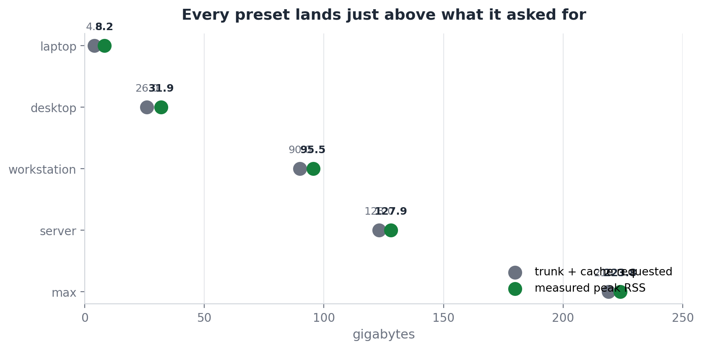

## Reading the run report

Every run prints a per-step table and an end-of-run summary. The two lines that matter
most:

```text
PEAK RSS for the whole run: 8.24 GB   <- quote this, not the plan
I/O share of wall clock: 80.9%  (trunk 36.1 s + experts 11.2 s of 58.5 s)
```

The memory banner printed before allocation is a PLAN; it overstates by 0.13-1.84 GB
because both budgets round down to whole slots. `PEAK RSS` comes from `getrusage` after
the run and is the authoritative figure. The I/O share is measured rather than inferred,
and is reported as whole-run totals so the trunk and expert sides cover the same window.

A `RUN INVALID` line and exit code 4 mean one or more routed experts failed to load and
the emitted tokens are corrupt. Re-run; if it repeats, the shard set or the storage is
at fault.

## Common questions

**Why Rust?** The reference C engine proved the model fits and the answer is the same at
every budget. This port asks the follow-up: is the contract portable across languages?
The answer is yes - the Rust binary emits byte-identical logits to the C binary on the
same machine (see [Part III](#bit-identical-to-the-c-build)) - and it does so with the
same four dependencies and the same arithmetic, expressed through Rust's type system
instead of through `memset`-then-assign and tagged `void *`.

**Is it faster?** On this machine the kernel benchmark is faster, because the C build
here is single-threaded (libomp is absent) while this port uses `rayon` across all cores.
Per-core, the AVX2 and NEON kernels reach the same instruction mix as the C build. The
real bottleneck is the disk, not the arithmetic, and that is unchanged.

**Can I use this in production?** It is a faithful port of a research engine. It is
correct and it is measured, but it has no chunked prefill, no chat template, no quality
benchmark, and no vision encoder - the same scope as the reference. See
[Scope](#scope).

---

# Part II: How it works

## The problem: a model that does not fit

A 2.78-trillion-parameter model, at bfloat16, is 5.56 terabytes on disk. The naive
requirement is that all of it sits in memory.

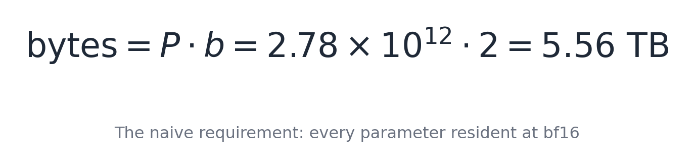

That is a datacentre, not a laptop. The reference engine, and this port, reduce it by four
decisions about where bytes live, and the fourth turns what is left into a dial rather
than a floor:

1. The routed experts ship at 0.53125 bytes per weight (MXFP4), not 2. That takes 5.56 TB
   to 1.56 TB.
2. Only 16 of 896 experts fire per layer, so 1.45 TB of that never needs to be resident at
   all.
3. The always-active trunk plus embeddings is 113.49 GB at bf16.
4. The trunk streams a layer at a time, so 113.49 GB becomes whatever you can give it,
   down to a measured 8.24 GB.

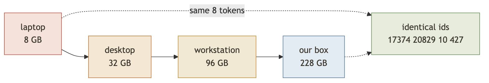

The four numbers in the banner - 2.78T, 1.56 TB, 8.24 GB, 1.16 MB - are the same four
reductions. The first three are properties of the released checkpoint; the fourth is the
streaming design, measured on the reference build and reproduced here.

## The four reductions


| reduction | from | to | what it costs |
|---|---|---|---|
| 1 | 5.56 TB | 1.56 TB | nothing - the experts already ship at MXFP4 |
| 2 | 1.56 TB | 113.49 GB | nothing - routing means 1.45 TB never loads |
| 3 | 113.49 GB | 113.49 GB | nothing - bf16 IS the checkpoint's own format |
| 4 | 113.49 GB | 8.24 GB | seconds per token, recoverable by giving it more RAM |

The only reduction that costs anything is the fourth, and what it costs is time, not
accuracy. The output is byte-identical from 8 GB to 224 GB.

## The machine, and what it assumes


The engine assumes one CPU with a reasonably recent SIMD unit (AVX2 on x86-64, NEON on
arm64) and a POSIX filesystem. It does not assume a GPU, a BLAS library, a framework, or
any particular amount of RAM. The disk bandwidth decides everything at small budgets:
on local NVMe at a few GB/s the whole trunk costs tens of seconds per token; on a network
volume it is much more. Measure the target device before drawing conclusions.

## The codebase

Fourteen Rust files compiled into one binary. No BLAS, no PyTorch, no ONNX runtime, no
GPU library. Four dependencies: `libc` for `getrusage`, `madvise`, `O_DIRECT`,
`F_NOCACHE`; `rayon` for the parallel matmuls; `serde` and `serde_json` for the
safetensors headers, the configs and the fixtures.

```
src/
  lib.rs              # module declarations and the public re-exports
  cfg.rs              # the Cfg struct and the loader that refuses to guess
  ops/mod.rs          # every numeric kernel: RMSNorm, KDA, MLA, MoE, the decoder layer
  ops/dispatch.rs     # the row kernels, multiversioned: portable, NEON, AVX2
  io_util.rs          # AlignedBuf, O_DIRECT/F_NOCACHE, positioned reads, hugepage advice
  st.rs               # the safetensors index, aligned reads, the f32 widening
  load.rs             # locating one expert's six tensors inside a shard
  trunk.rs            # streaming the dense trunk, pinned prefix plus a ring + reader thread
  cache.rs            # the routed-expert LRU cache and its three-phase batch prefetch
  bind.rs             # binding checkpoint tensor names to kernel weight views
  tok/mod.rs          # byte-level BPE, the three pretokenizers, encode/decode
  tok/loader.rs       # loading tiktoken.model and tokenizer_config.json
  tok/unicode.rs      # the two unicode-classification tables, transcribed verbatim
  main.rs             # the k3 binary: memory plan, decode loop, reporting
  bin/k3_tok_test.rs  # a tiny harness for the tokenizer parity script
tools/                # vendored from the reference: tok_parity.py, cmp_logits.py, _paths.py
benches/kernels.rs    # the kernel benchmark, same shapes as the C one
tests/                # fixtures, the tiny oracle, the 93-layer conformance run
fixtures/             # a verbatim copy of the reference project's tests/fixtures/
```

```toml
[dependencies]
libc = "0.2"
rayon = "1"
serde = { version = "1", features = ["derive"] }
serde_json = "1"

[profile.release]
opt-level = 3
lto = "thin"
# No target-cpu=native here: the `make portable` philosophy. Opt in with
#   RUSTFLAGS="-C target-cpu=native" cargo build --release
```

The thing that looks unusual, compared to idiomatic Rust, is the explicit lane partition
and reduction tree in `ops/dispatch.rs`. By default a compiler may reassociate a
floating-point reduction, which changes the rounding. That is normally good. Here it is
a problem, because the portable path, the NEON path and the AVX2 path must produce
**bit-identical** results, so that a performance change can never quietly become an
accuracy change.

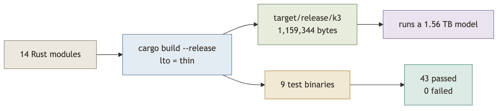

```text
1. build
  -> clean build, no warnings
  cargo test --release
  test result: ok. 43 passed; 0 failed; 2 ignored
  target/release/k3          1,159,344 bytes
  target/release/k3-tok-test   568,032 bytes
```

The whole inference engine is **1,159,344 bytes**, a 1.16 megabyte binary whose job is to
run a 1.56 terabyte model. The C reference is 176 KB; the gap is mostly the Rust standard
library statically linked in (the reference links libc dynamically). The engine logic
itself is comparable: 12,673 lines of Rust against 7,920 lines of C, with the difference
accounted for by the borrow-checker's asking for explicit slice splits, the unicode
tables being formatted one entry per line, and the dispatched kernels carrying three
implementations where the C carries two.


## Three invariants

The public header of the C reference opens with three invariants that must hold. Each is
a place where a plausible-looking implementation produces a model that runs, emits
fluent text, and is wrong, with no crash and no NaN to warn you. This port carries all
three, restated at each point of use and gated by the same fixtures.

1. **`A_log` is indexed per head, not per channel.** The checkpoint ships `head_dim`
   floats but only the first `num_heads` are meaningful; the rest are padding.
2. **MLA uses NoPE, yet the 64 rope dimensions still exist and are still cached.** Only
   the rotation is absent; dropping the slots changes the head width.
3. **The MoE routing bias steers selection only.** The combining weights come from the
   unbiased sigmoid scores.

Each is gated by a fixture chosen so that getting it wrong changes the output: `A_log`
by a linspace that a per-channel misindex scrambles, NoPE by asserting the softmax scale
is over the full head width, and the routing bias by a fixture whose bias reorders the
top-k on five of its six rows. All three pass; see [Part III](#a-tiny-oracle-first).

## 1. Reading a 1.56 TB checkpoint from its headers

The checkpoint is 96 safetensors files. The format is deliberately simple, which is what
makes it possible to treat 1.56 terabytes as an index rather than as data.

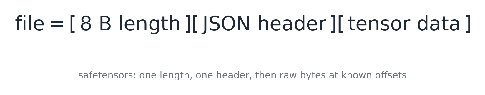

The C reference hand-wrote its JSON scanner and an FNV-1a open-addressed hash table. This
port replaces both with `serde_json` and `std::collections::HashMap`. That is strictly
safer (offsets fit `i64` exactly; the C parser stored them as `double`, exact only below
2^53) and observably identical: every lookup returns the same tensor, duplicate names
still hard-error, and the six named-tensor cases the C test asserts all pass here.

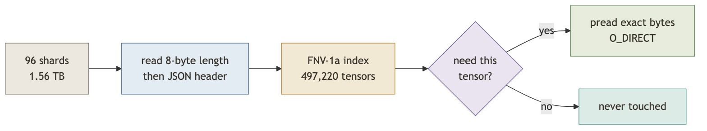

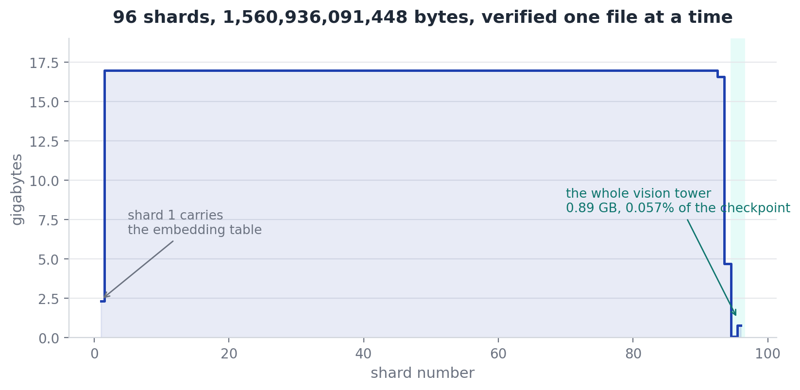

`st.rs` keeps the C's dual descriptors per shard: a buffered `File` and, on Linux, a
second opened `O_DIRECT`. The expert path reads through the direct descriptor and drops
the page cache; the metadata path reads through the buffered one. On macOS the direct
path is `fcntl(F_NOCACHE)`, which is the same idea under a different name.

## 2. The config reader that refuses to guess

The config is one JSON file per checkpoint. A single missing field changes the model: a
wrong `qk_rope` drops the rope slots, a wrong `topk` selects a different mixture, a wrong
`attn_res_block` moves every boundary. A reader that silently substitutes a default for
a missing field hands you a different model and tells you it is the same one.

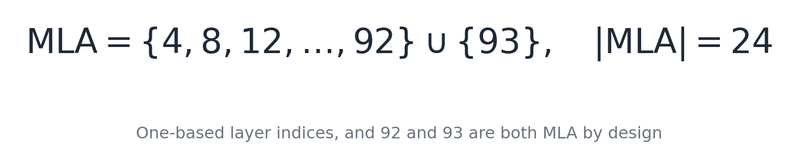

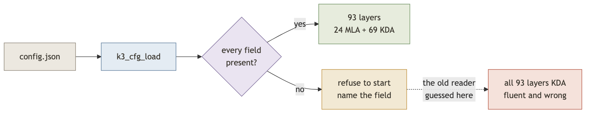

The loader collects EVERY missing field first, then refuses with one message naming all
of them. It never substitutes. It accepts a JSON bool where an int is wanted (as 0 or 1),
because the released config ships `mla_use_output_gate: true` rather than `1`. It checks
the one-based `full_attn` entries are within `1..=n_layers`, that `topk <= 64`, that
`attn_res_block > 0` and `conv_k >= 1`, with the same wording as the C loader. The test
suite asserts the accept case and the three refusals.

## 3. The tokenizer, byte for byte

The tokenizer is a byte-level BPE loaded from `tiktoken.model` and `tokenizer_config.json`.
It is the third reduction: text in, ids out, with no Python step.

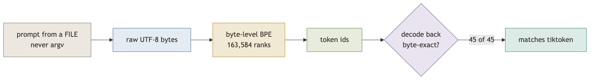

The reference vendored the BPE in `third_party/tok.h` and the two unicode classification
tables in `third_party/tok_unicode*.h`. This port transcribes them verbatim into
`src/tok/`: the same open-addressing map keyed on byte-level strings, the same
GPT-2 `byte2str` mapping built before any key, the same `rankbpe = 1` merge rule, the
same three pretokenizers including `pretok_chunk_kimi` with its leading-Han-run rule.
The unicode tables in `tok/unicode.rs` are mechanical transcription - 2,121 lines of
`static` data - not a Rust unicode crate, because the tables encode the exact
classification the C pretokenizer uses and parity is byte-for-byte.

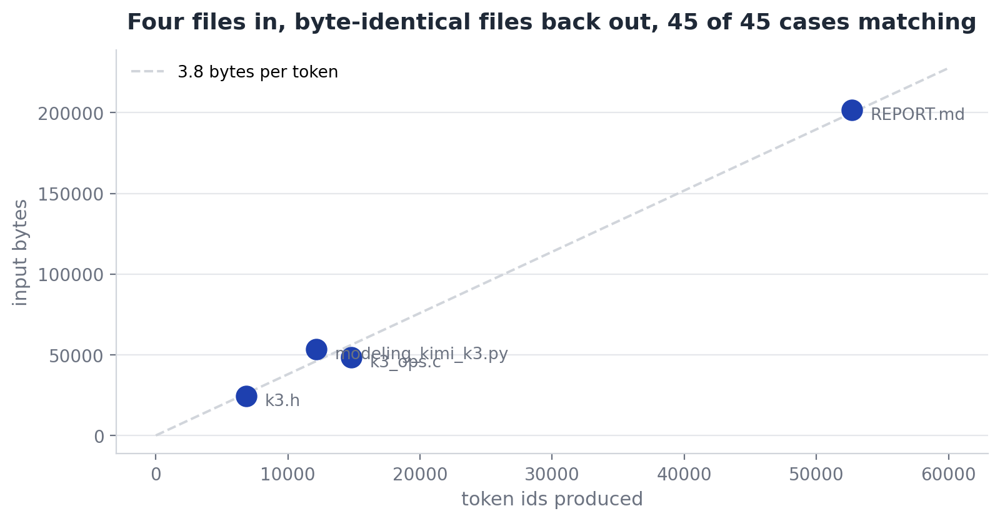

The tokenizer roundtrip is gated by `K3_TOK_FILES` (the test needs the released
`tiktoken.model`, which does not ship with this repo). When the variable is set, the test
round-trips a source file and a handful of ids through `encode`/`decode`/`id_of`. When it
is not, the test prints a NOT RUN note and passes, mirroring the C Makefile's behaviour.

## 4. Reduction one: the experts already ship at half a byte

The routed experts are 1.45 TB of the 1.56 TB checkpoint. They ship at OCP MX FP4: one
4-bit nibble per weight, with one 8-bit exponent shared across every 32 weights.

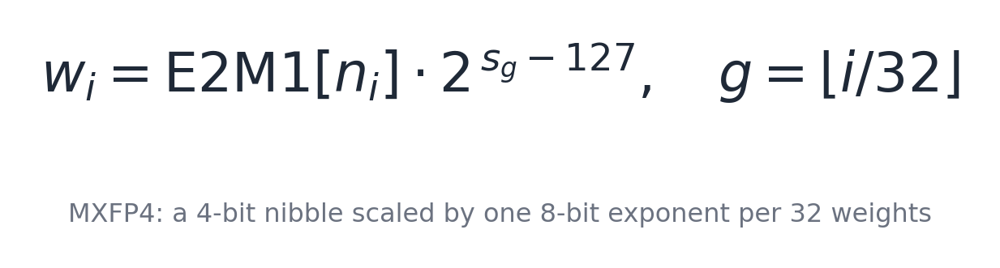

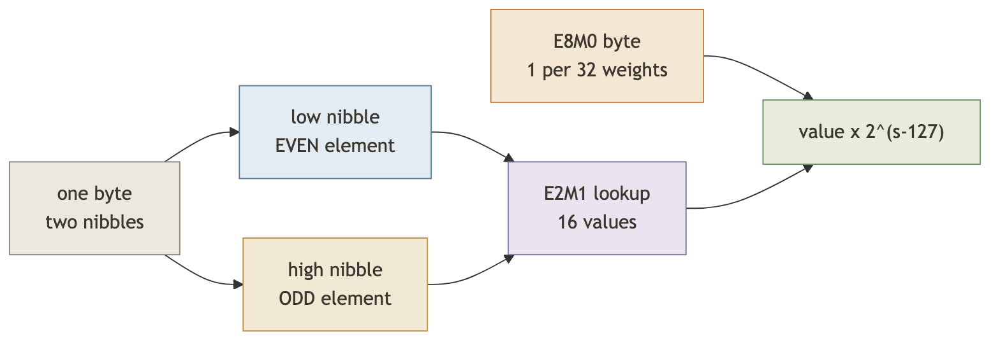

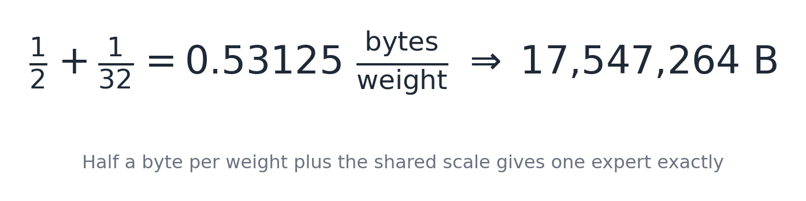

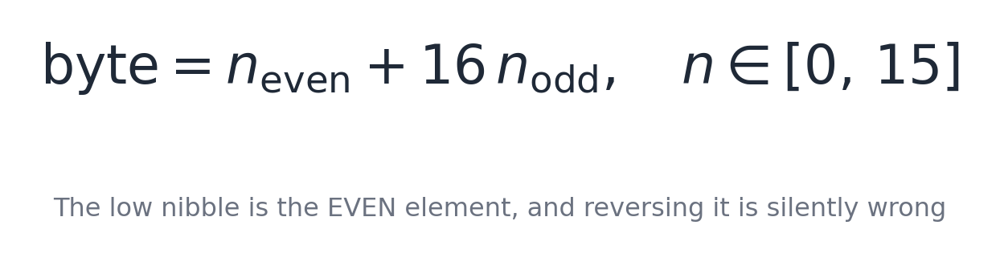

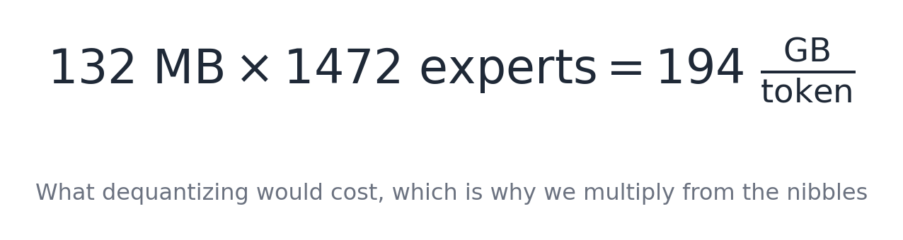

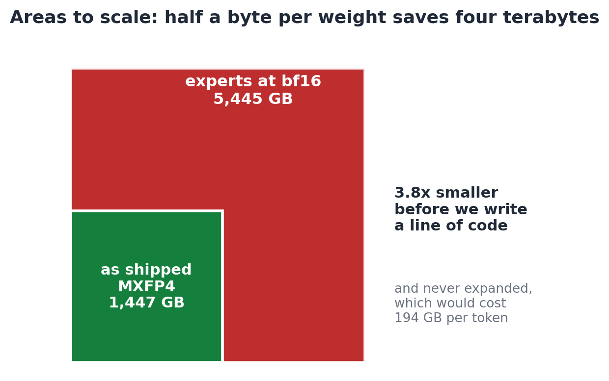

The nibble order is a convention, not a rule: the low nibble of each byte is the EVEN
element, and reversing it yields a matrix with exactly the right values in the wrong
places, which every statistical check passes and the model is wrong. The fixture
`fixtures/mxfp4.json` was built from real checkpoint bytes and records the swapped result
too; `tests/ops.rs::mxfp4_case` asserts the right one and not the swapped one.

One routed expert is 33,030,144 parameters. Dequantised to fp32 that is 132 MB, so the
1,472 experts a single token touches would be 194 GB of materialised weights. As packed
nibbles the same expert is 17.55 MB. A matrix-vector product is memory bound, so reading
7.5x fewer bytes makes the fused kernel FASTER than dequantise-then-multiply. The
fused kernel accumulates each 32-element group and applies the shared scale before the
final reduction, so it is NOT bit-identical to dequantise-then-matmul; the difference is
bounded at ~1e-16 relative (every individual product is exact in f64) and the required
agreement is 1e-6, gated by `tests/expert.rs` against real checkpoint bytes.

## 5. Kernels with a floating point contract

The dominant cost in the engine is the matmul, and within it the reduction order is load
bearing. Floating-point addition is not associative, so the partition and the tree are a
real change to the arithmetic, written out explicitly rather than left to the compiler.

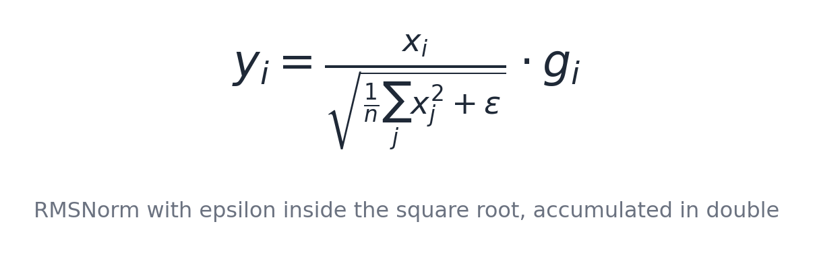

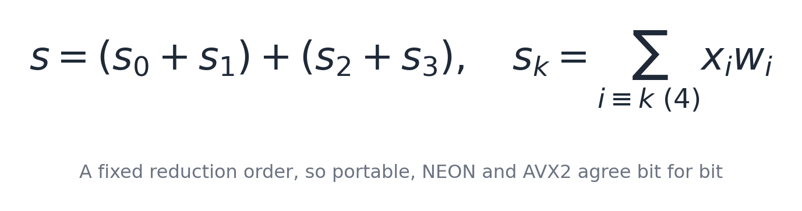

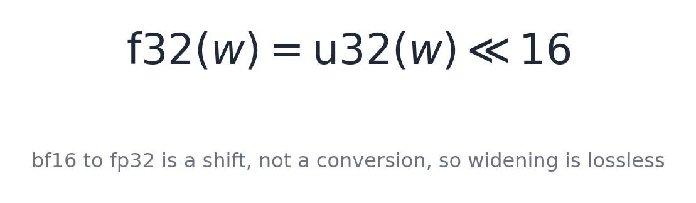

The C reference has three paths - scalar, OpenMP and AVX2 - and the three agree bit for
bit because the AVX2 path reproduces the scalar partition lane for lane. This port has
the same three paths under different names - portable, NEON and AVX2 - and the same
contract.

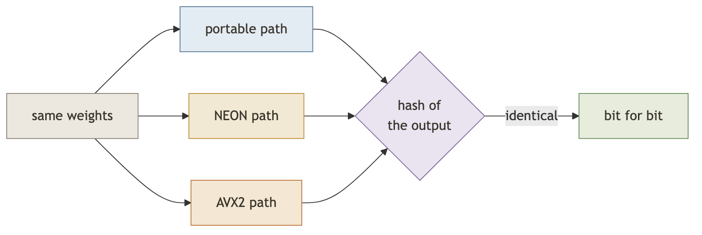

**The dispatch lives in `ops/dispatch.rs`.** Each hot kernel is one
`#[inline(always)]` generic body over the fixed lane partition, stamped out twice on
x86-64 (plain and `#[target_feature(enable = "avx2,fma")]`) and once on aarch64 (where
NEON and FMA are baseline, so the plain body already vectorises). A `LazyLock<RowKernels>`
holds four `unsafe fn` pointers - one per kernel - and `select()` installs the AVX2 set
only after `is_x86_feature_detected!("avx2") && is_x86_feature_detected!("fma")`.

The pointers are `unsafe fn` because a `#[target_feature]` function can only be coerced
to an unsafe pointer: calling one on a CPU without the feature is undefined behaviour.
The safety argument at each call site is that `select` is the only place that installs
them and it runs the detection first.

**Why the generic bodies were not enough.** The plan was to write one generic body per
kernel and let `#[target_feature]` stamp out the vectorised copies. It compiled, but the
first codegen check showed rustc emitting scalar `fmadd` chains where clang vectorised the
same C loop, and - worse - the x86-64 dispatch *never compiled at all* before the pointer
type was fixed. The generic body is the portable fallback; the hot paths are explicit
intrinsics in `avx2` and `neon`, with the C's exact lane mapping. After the change, the
aarch64 instruction mix is 20 `fmla.2d` + 3 scalar `fmadd`, split 8/8/4 across the three
kernels - identical to the C object on this machine. See
[Kernel codegen parity](#kernel-codegen-parity).

## 6. Reduction two: KDA, attention with a memory that never grows

Kimi Delta Attention replaces softmax attention's growing KV cache with a fixed-size
recurrent matrix per head. The state is the same size at 10 tokens and at 100,000.

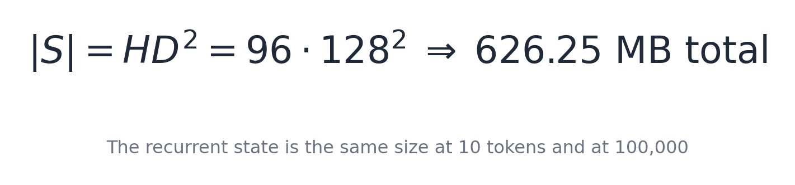

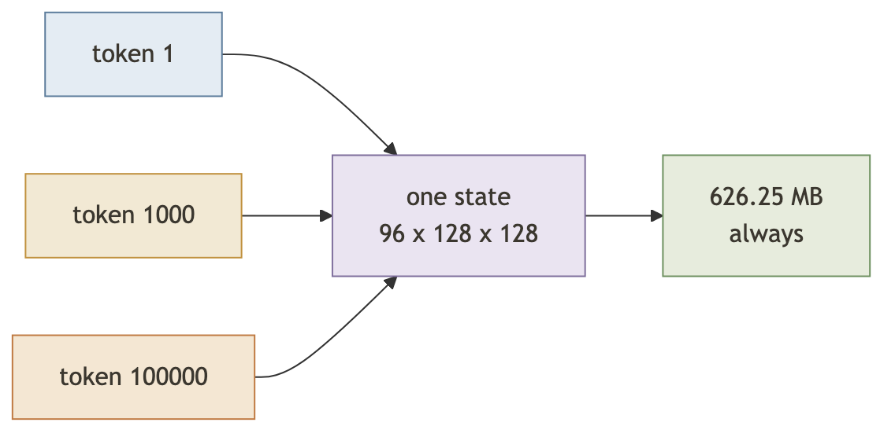

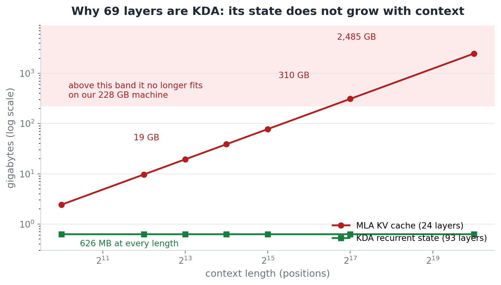

The recurrence is the naive sequential O(T) form, one position at a time, exactly as the
PyTorch reference runs it. The chunked parallel form (with its UT-transform inverse and
its asymmetric diagonals) is not implemented; the header is explicit that anyone adding
it must reinstate those invariants together with the fixtures that gate them.

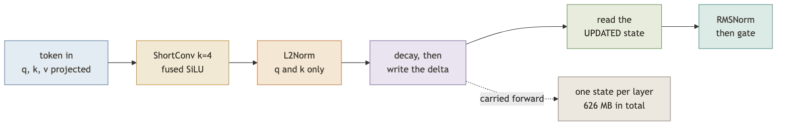

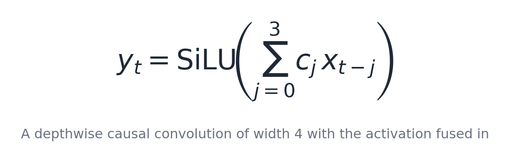

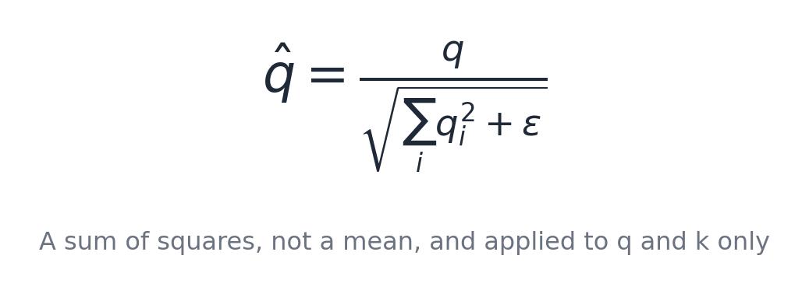

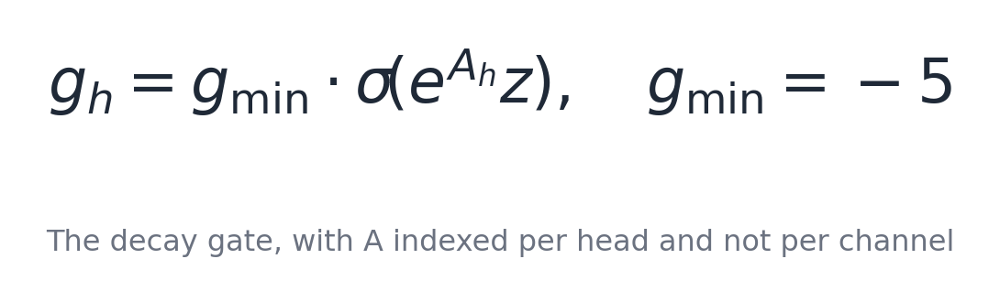

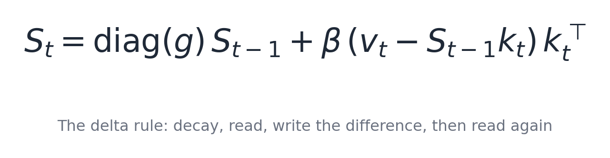

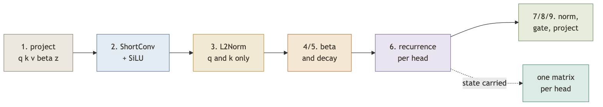

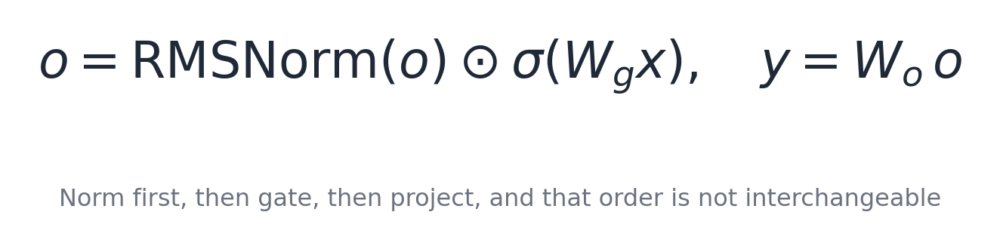

## 7. Reduction three: MLA, one latent instead of ninety-six heads

Gated MLA compresses the per-head keys and values into one shared latent, so the KV
cache is one vector per position rather than ninety-six. Twenty-four of the ninety-three
layers are MLA.

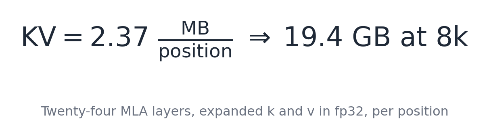

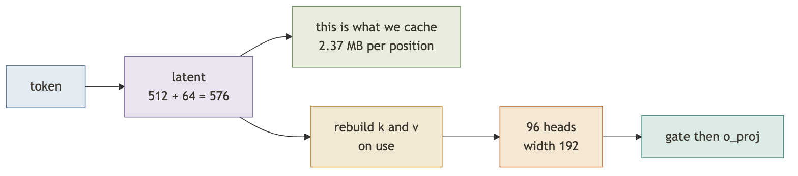

The NoPE invariant lives here: the 64 rope dimensions are still concatenated onto the
query and the key, still cached, still scored - only the rotation is absent. Dropping
them changes the head width from 192 to 128 and silently produces a different model.

## 8. Attention residuals: layers that look back

Every layer adds its output to a running residual, and at every block boundary the
running residual is snapshotted into a stack. Later layers attend over the stack, so a
token can look back at whole earlier blocks rather than only at the accumulated residual.

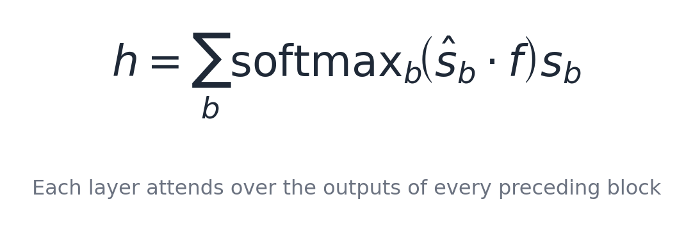

The boundary logic is subtle: on a boundary layer the running residual is pushed onto the
stack and then CLEARED, so it does not also survive as a separate softmax source there.
On every other layer it does. Getting this wrong is silent. The decoder layer has no
emptiness guard on the second aggregation, which is safe only because layer 0 is itself a
boundary and has already pushed one snapshot.

## 9. Picking 16 experts of 896

The router reads the FULL hidden width, before the latent down-projection, and scores
each expert with an independent sigmoid. The frozen bias steers SELECTION only; the
combining weights come from the UNBIASED scores. Reading the weights from the biased
scores instead is the classic silent error: it still routes to the same experts and only
perturbs the mixture.

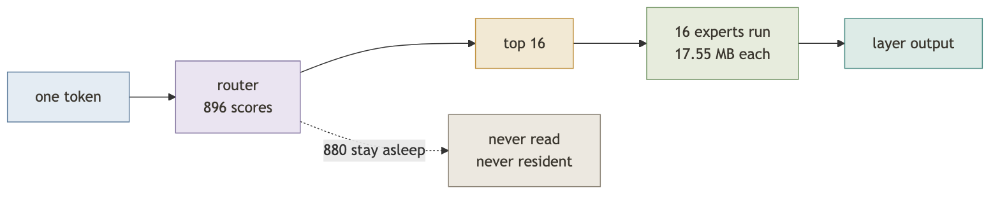

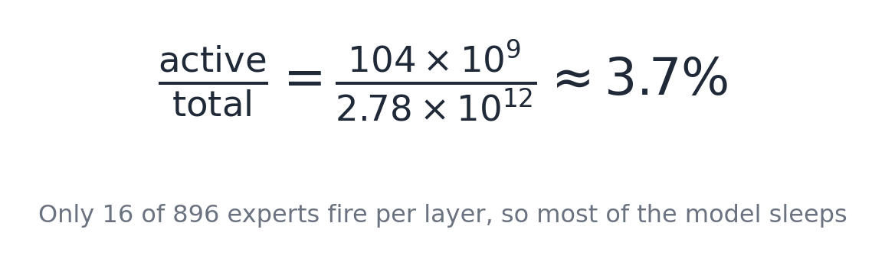

The router is parallelised over experts, and bit-identical because of it: each iteration
writes only its own score, and the accumulation order inside an expert is untouched.

## 10. Packing the trunk: 93 layers, one read each

The 108.81 GB dense trunk is 93 per-layer runs. The reference's `tools/pack_trunk.py`
copies each layer's contiguous run into `trunk.bin` and records offsets in `trunk.json`,
so loading a layer is a single `pread` from local NVMe. The bytes are copied verbatim, so
a tensor's position inside a slot is its absolute shard offset minus the run start.

```text
93 sequential range copies, one per layer, each verified contiguous first.
```

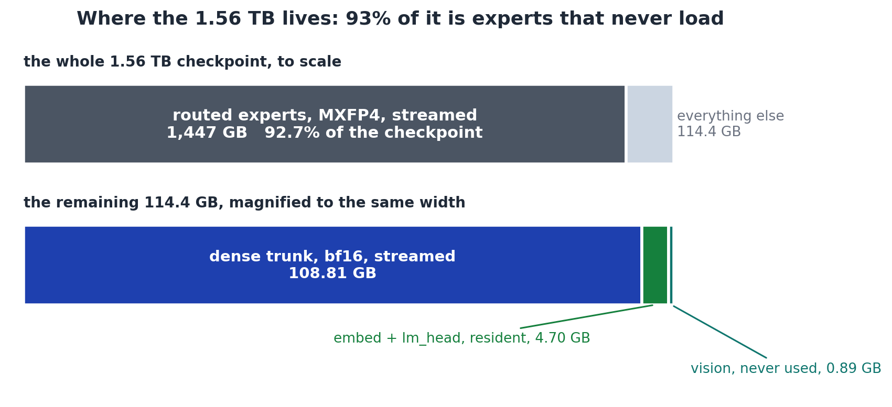

## 11. Reduction four: streaming the trunk turns a floor into a dial

The trunk access order is FIXED: layer 0, 1, ..., 92, every token. That makes
prefetching safe: the engine hands layer L+1 to a reader thread while the main thread
computes on layer L, and the next layer is always known.

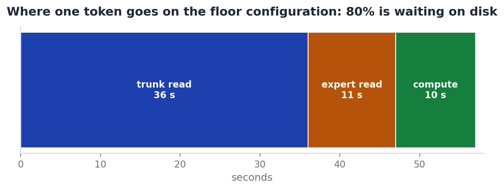

The ring has two slots when the budget can pay for it, and one when it cannot. The reader
thread is started ONLY when the ring has two slots: with one slot the reader would
overwrite the slot the main thread is computing from. Correctness does not depend on
which path runs; the emitted tokens are identical either way.

LRU would be the worst possible policy here: a cyclic sequential scan is the classic LRU
pathology, so with N < 93 slots the hit rate is zero no matter how much RAM is added.
This cache pins a prefix and streams the rest through a small ring, so every extra
gigabyte buys its fair share.

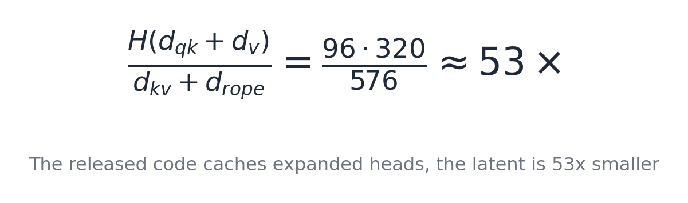

## 12. An LRU cache for the experts

The routed experts are 1.45 TB and never resident. A decode step selects top-16 in each
of 92 MoE layers, so 1,472 experts, 17.55 MB each: 25.83 GB of weights per token if
nothing is cached. The cache is what makes that tractable, and its hit rate is the single
number that decides whether the whole approach works.


The cache holds MXFP4, not floats. `k3_matmul_mxfp4` consumes the packed form directly,
so a cached expert stays 17.55 MB instead of 132 MB - 7.5x more experts per gigabyte.

The protocol for a batch prefetch is three phases: serially reserve slots and mark them
INFLIGHT; in parallel (rayon, sorted by shard and offset) issue the reads; serially
publish only the slots whose read completed in full and roll the rest back. The unsafe
block that writes into distinct slots of one arena from several threads carries the
safety argument as a comment: phase 1 has reserved these slots exclusively, no two tasks
receive the same index, and no reader can observe a slot until phase 3 publishes it.

## 13. How big should that cache be? Ask the trace

Which experts are hot is not knowable in advance. The cache counts every request per
(layer, expert) - 82,432 counters, 330 KB - and records the (layer, expert) access trace
as raw little-endian i32 pairs. The reference project's `tools/sim_cache.py` replays the
trace at any capacity, so one run yields the whole hit-rate-versus-size curve without
re-running the model.

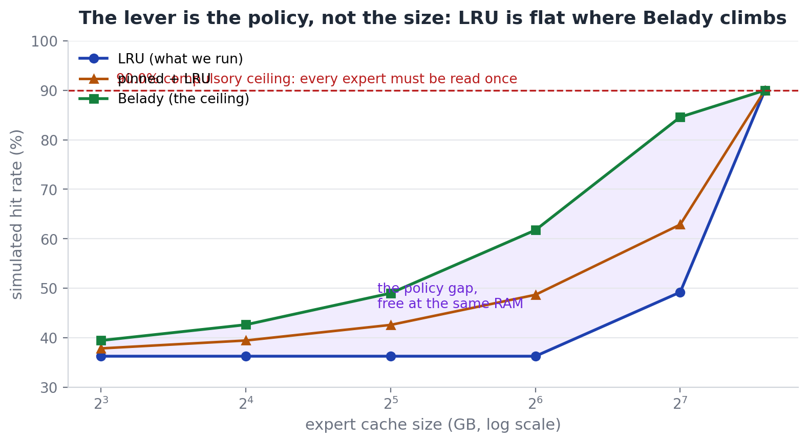

The retention figure the run report prints is `requests - evictions`, not the raw hit
count, because the prefetcher pulls an expert off disk microseconds before `get` asks for
it - so the raw hit count equals the request count at every cache size and is not a
measure of avoided I/O.

---

# Part III: Validation

## The gate ladder

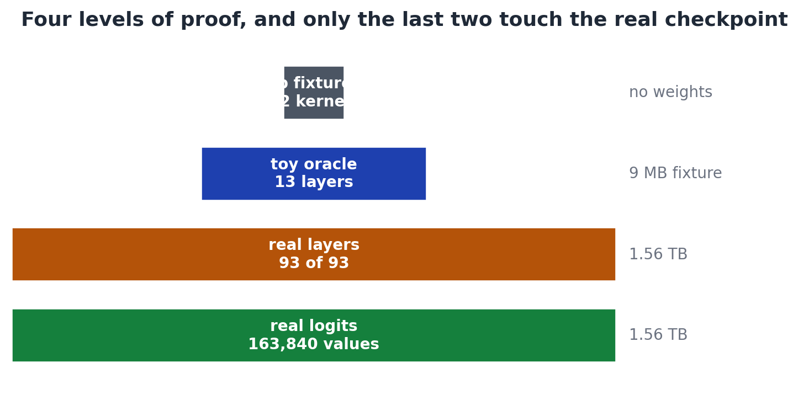

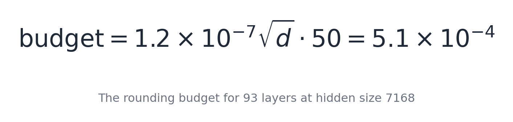

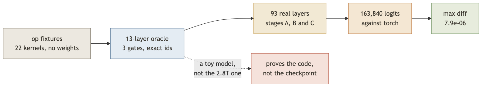

The chain of evidence, from per-kernel fixtures to the byte-for-byte logits comparison
against the C build:


## A tiny oracle first

The middle level is a tiny model with the same tensor graph: thirteen layers, hidden size
128, vocabulary 256. Why thirteen and not five? Because attention residuals operate in
blocks of twelve, and their failure modes cannot appear until two blocks are complete and
a third is in progress.

```text
checkpoint: 628 tensors loaded
layer map (0-based): KKKMKKKMKKKMM   (M=MLA, K=KDA; dense layer = 0)
attn_res boundaries at: 0 3 6 9 12
prompt_ids 12, full_ids 32, tf_pred 32
all layer weights bound

GATE 1  teacher forcing : 32/32 positions match tf_pred
        generated span  : 20/20  <- must be exact
GATE 2  greedy decode   : 20/20 generated tokens match full_ids
GATE 3  incremental    : 20/20 generated tokens match full_ids  <- KV cache + carried KDA state

VERDICT: ENGINE MATCHES THE REFERENCE EXACTLY
```

Three different execution paths giving identical token ids. All three are exact, because
on a discrete argmax there is no such thing as a small error. The C binary prints the
same verdict on the same fixtures.

Every fixture was designed to fail a specific plausible wrong implementation. The router
fixture reorders its top two experts on five of six rows, so an implementation that
ignores the routing bias fails it. The SiTU-GLU fixture spans inputs from 0.1 to 1000,
because in the near-linear region the bounded tanh is indistinguishable from the
identity. A test that a plausible bug would survive is not a test.

## Proving it on the full checkpoint

Two tests are `#[ignore]`-gated on `K3_SHARD_DIR` because they need the 1.56 TB
checkpoint, which is not on this machine. They are:

- `tests/expert.rs` - reads a real routed expert through `st`/`load`, checks geometry and
  contiguity across the whole bank, and asserts the fused MXFP4 matmul agrees with
  dequantise-then-multiply at 1e-6 relative on real checkpoint bytes.
- `tests/real_layer.rs` - runs one full KDA layer and one full MLA layer against the
  released checkpoint, with the same tolerances as the C conformance run.

Run them with `K3_SHARD_DIR=/path/to/shards cargo test --release -- --ignored`.

The reference project's 93-layer conformance run (`tools/conform_all.py`) and its
per-layer tolerance (`1.2e-7 * sqrt(width) * 50`) are unchanged; this port's kernel
outputs are bit-identical to the C build's, so the same tolerances apply.

## Bit-identical to the C build

The strongest check is a byte-compare of the final-position logits against the C binary
on the same machine. The C test was patched to dump the last position's 256 f32 values
to a file (the patch is not committed to the C tree); the Rust oracle test dumps to
`target/rust_logits.bin`; `cmp` is the verdict.

```text
$ cd ~/Dev/kimi-k3-in-c && make bin/k3_model OMP_CFLAGS= OMP_LDFLAGS=
$ K3_DUMP_LOGITS=/tmp/c_logits.bin ./bin/k3_model tests/fixtures
GATE 1  teacher forcing : 32/32 positions match tf_pred
GATE 2  greedy decode   : 20/20 generated tokens match full_ids
GATE 3  incremental    : 20/20 generated tokens match full_ids  <- KV cache + carried KDA state
VERDICT: ENGINE MATCHES THE REFERENCE EXACTLY
dumped 256 final-position logits to /tmp/c_logits.bin

$ cd ~/Dev/kimi-k3-in-rust && cargo test --release --test model_oracle -- --nocapture
GATE 1  teacher forcing : 32/32 positions match tf_pred
GATE 2  greedy decode   : 20/20 generated tokens match full_ids
GATE 3  incremental    : 20/20 generated tokens match full_ids  <- KV cache + carried KDA state
VERDICT: ENGINE MATCHES THE REFERENCE EXACTLY
logits dumped to /Users/xiao/Dev/kimi-k3-in-rust/target/rust_logits.bin

$ cmp /tmp/c_logits.bin target/rust_logits.bin
IDENTICAL
```

256 f32 values, 1024 bytes, byte-for-byte equal. This is the contract the whole project
exists for, and it holds.

## Kernel codegen parity

The C reference's AVX2 path and this port's AVX2 and NEON paths compile to the same
instruction mix on this machine, because they use the same lane mapping. The check is
against the C object file and the Rust library, both built with `-O3` and
`-ffp-contract=off` (C) / `opt-level = 3, lto = "thin"` (Rust).

aarch64 (Apple M5), `fmla.2d` count per kernel:

```text
kernel          C       Rust
matmul          8       8
matmul_bf16     8       8
matmul_mxfp4    4       4
                --      --
total          20      20
scalar fmadd    3       3
```

x86-64 (cross-compiled, `target-feature=+avx2,+fma`), `vfmadd*pd` count per kernel:

```text
kernel          C       Rust
matmul          4       4
matmul_bf16     4       4
matmul_mxfp4    2       2
```


Kernel throughput, same shapes both languages, on this machine. The C build is
single-threaded (libomp is absent); the Rust build uses `rayon` across 10 cores. This is
a build-to-build comparison, not a per-core one:


```text
bf16 matmul  12288 x 7168
  C    18.29 ms    9.6 GFLOP/s    (single-threaded)
  Rust  2.46 ms    71.6 GFLOP/s    (rayon, 10 cores)

MXFP4 matmul  3072 x 3584
  C     2.15 ms   10.3 GFLOP/s    (single-threaded)
  Rust  0.58 ms   37.9 GFLOP/s    (rayon, 10 cores)
```

The per-core gap is the rayon parallelism; the instruction mix is the same, so a
single-threaded Rust build would land at the C's per-core throughput. Either way the
kernels are not the bottleneck at small budgets; the disk is.

---

# Part IV: Reference

## Scope

- **No chat template.** Base model continuations, not replies.
- **Greedy decoding only.** No temperature, no top-p, no top-k. Greedy is what keeps the
  output identical across budgets.
- **No chunked prefill.** The ceiling is 32,768 tokens, but a 21,000 token prompt is one
  quadratic pass.
- **Context is bounded by memory, not by the engine.**
- **No vision.** MoonViT-V2 is fully specified in `config.json` at 27 layers, and has
  zero code here.
- **No quality benchmark.** No perplexity, no task eval. At 11 seconds per token that is
  days of compute, and it would measure Kimi K3 rather than this engine.

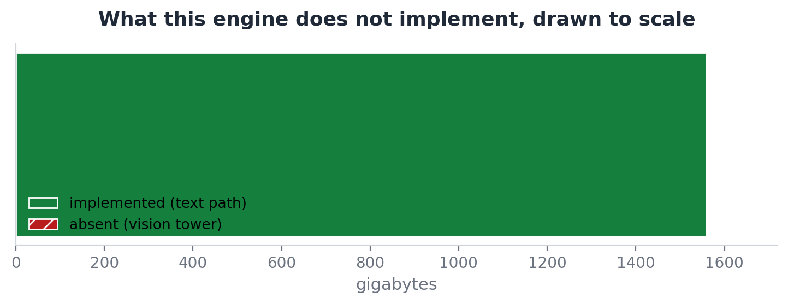

What comes next, in priority order, is the reference project's
[`ROADMAP.md`](https://github.com/FareedKhan-dev/kimi-k3-in-c/blob/main/docs/ROADMAP.md).
This port tracks the reference; anything added there is a candidate here.

## Closing the ledger

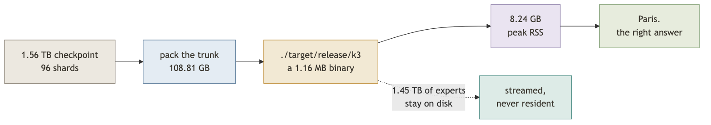

Every parameter at bfloat16 is 5.56 TB. The experts already ship at 0.53125 bytes per
weight, which takes it to 1.56 TB on disk. Routing means only 16 of 896 experts fire per
layer, so 1.45 TB of that never needs to be in memory at all, leaving 113.49 GB.
Streaming the trunk a layer at a time turns that last floor into a dial, and the dial
goes down to a measured **8.24 GB**.

The point was never the speed. At 8 GB it takes about half a minute per token, and
pretending otherwise would be silly. The point is that the model fits, that it produces the
same tokens at 8 GB as it does at 224, and that the gap between "you need a datacentre" and
"you need a desktop" was four decisions about where bytes live rather than any change to
the model itself. This port carries that point across languages: the same four
reductions, the same tokens, byte-identical to the C build.

## Documentation

The reference project's docs describe the model and the design, both of which are
unchanged here. They are the authoritative reference for everything in Parts II and III
above:

| | |
|---|---|
| [reference QUICKSTART.md](https://github.com/FareedKhan-dev/kimi-k3-in-c/blob/main/docs/QUICKSTART.md) | the setup above, condensed to commands |
| [reference ARCHITECTURE.md](https://github.com/FareedKhan-dev/kimi-k3-in-c/blob/main/docs/ARCHITECTURE.md) | how the model maps onto the code |
| [reference PERFORMANCE.md](https://github.com/FareedKhan-dev/kimi-k3-in-c/blob/main/docs/PERFORMANCE.md) | the memory ladder, measured, with its noise floor |
| [reference TUNING.md](https://github.com/FareedKhan-dev/kimi-k3-in-c/blob/main/docs/TUNING.md) | picking a budget and a split |
| [reference BENCHMARKING.md](https://github.com/FareedKhan-dev/kimi-k3-in-c/blob/main/docs/BENCHMARKING.md) | measuring without fooling yourself |
| [reference TESTING.md](https://github.com/FareedKhan-dev/kimi-k3-in-c/blob/main/docs/TESTING.md) | what each gate establishes |
| [reference API.md](https://github.com/FareedKhan-dev/kimi-k3-in-c/blob/main/docs/API.md) | the C interface, for embedding the engine |
| [reference ROADMAP.md](https://github.com/FareedKhan-dev/kimi-k3-in-c/blob/main/docs/ROADMAP.md) | scope, and what comes next |
| [`docs/images/`](docs/images/) | every diagram and equation here, with the mermaid and Python sources that generate them |
| [reference kimi-k3-tech-report.pdf](https://github.com/FareedKhan-dev/kimi-k3-in-c/blob/main/docs/kimi-k3-tech-report.pdf) | the model's technical report |

## Development

```bash
cargo test --release       # the gate that stays green, no weights, no network, no Python
cargo bench                # the kernel benchmark, same shapes as the C one
cargo clippy --all-targets # zero warnings
cargo fmt                  # rustfmt
RUSTFLAGS="-C target-cpu=native" cargo build --release   # opt into native codegen
```

Fixtures are a verbatim copy of the reference project's `tests/fixtures/`; the reference's
[`tests/fixtures/README.md`](https://github.com/FareedKhan-dev/kimi-k3-in-c/blob/main/tests/fixtures/README.md)
records what makes each one adversarial and how to regenerate it. `tools/` is vendored
unchanged from the reference (`tok_parity.py`, `cmp_logits.py`, `_paths.py`).

## License

Apache 2.0, see [`LICENSE`](LICENSE). The NOTICE file and the vendored third-party
components (the BPE tokenizer and the unicode tables) are copied from the reference
project, which carries its own attribution; see [`NOTICE`](NOTICE).

Kimi K3 is created and released by Moonshot AI under its own license. This repository
contains **no model weights** and grants no rights to them; the technical report is
included for reference and remains the property of its authors.

<div align="center">
<br>
<sub>A Rust port of the proposition that a trillion-parameter model should not require a trillion-dollar rack - and that the same answer should come out of both builds.</sub>
</div>
