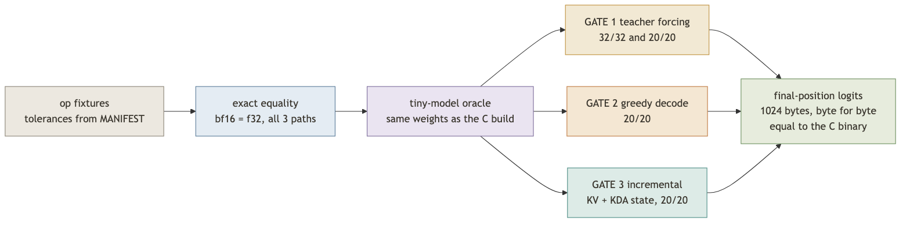
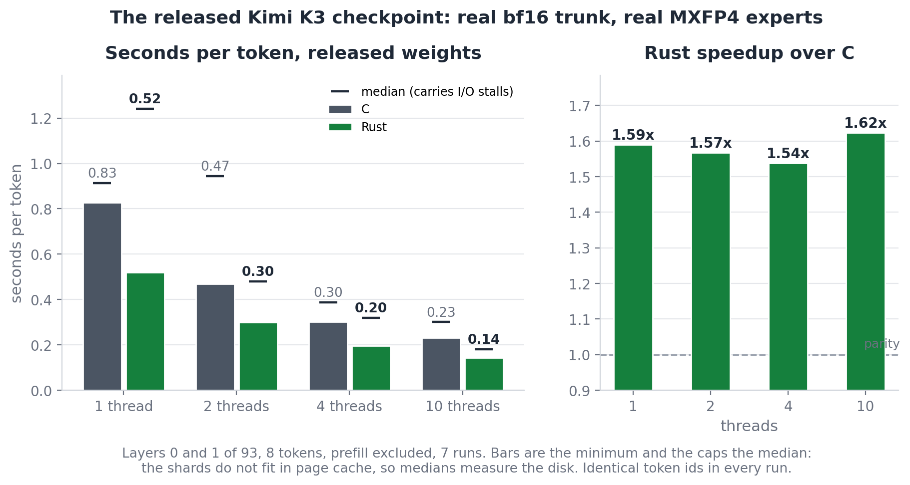
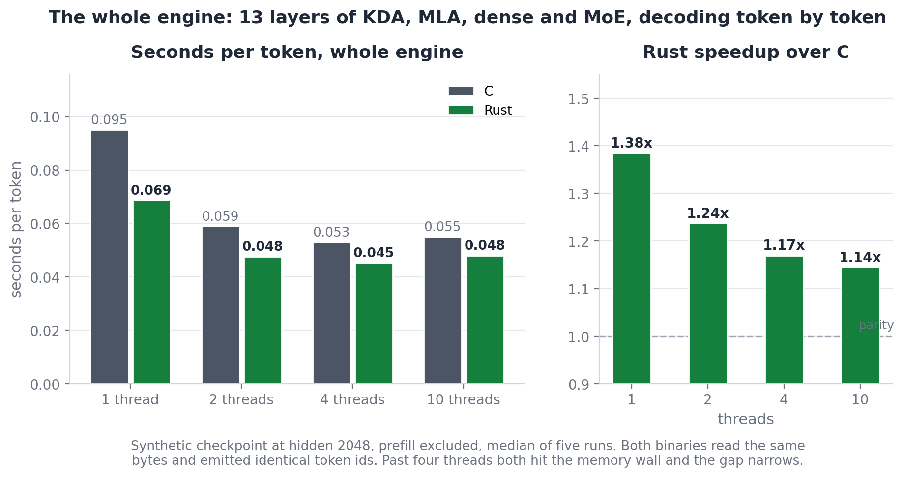
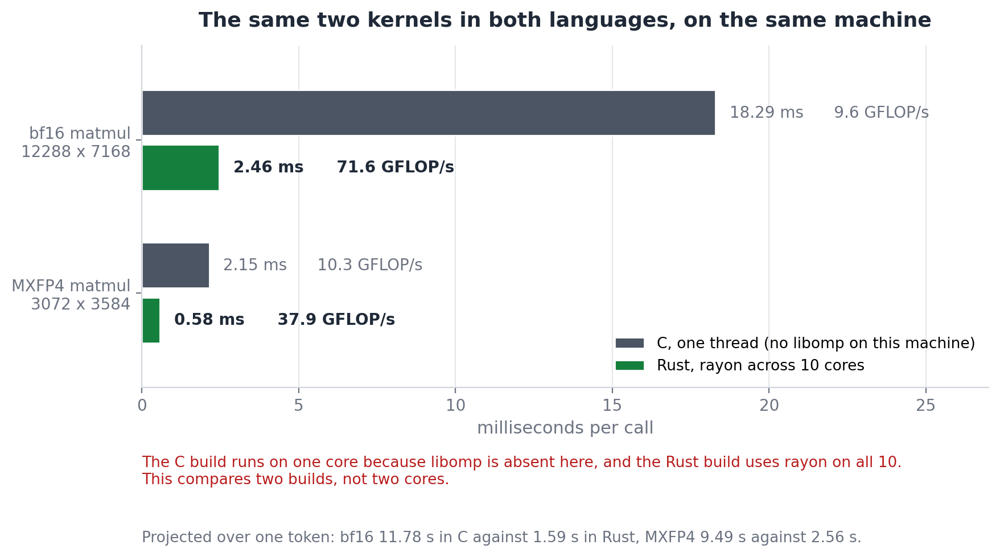
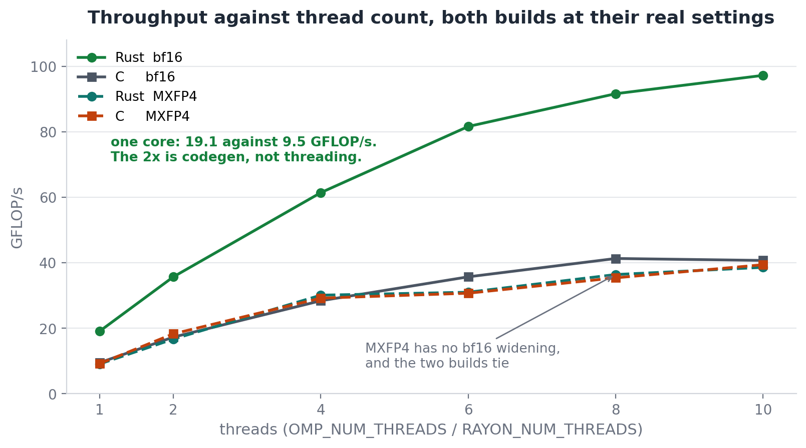
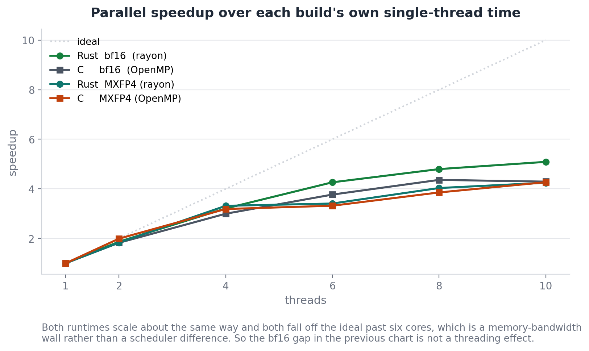
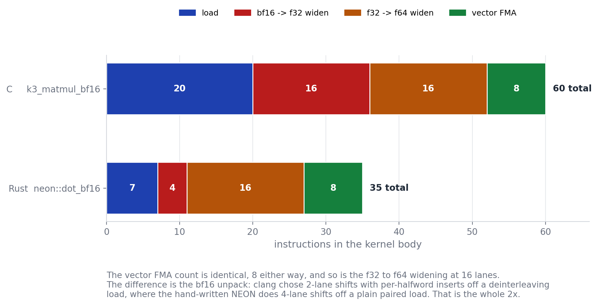
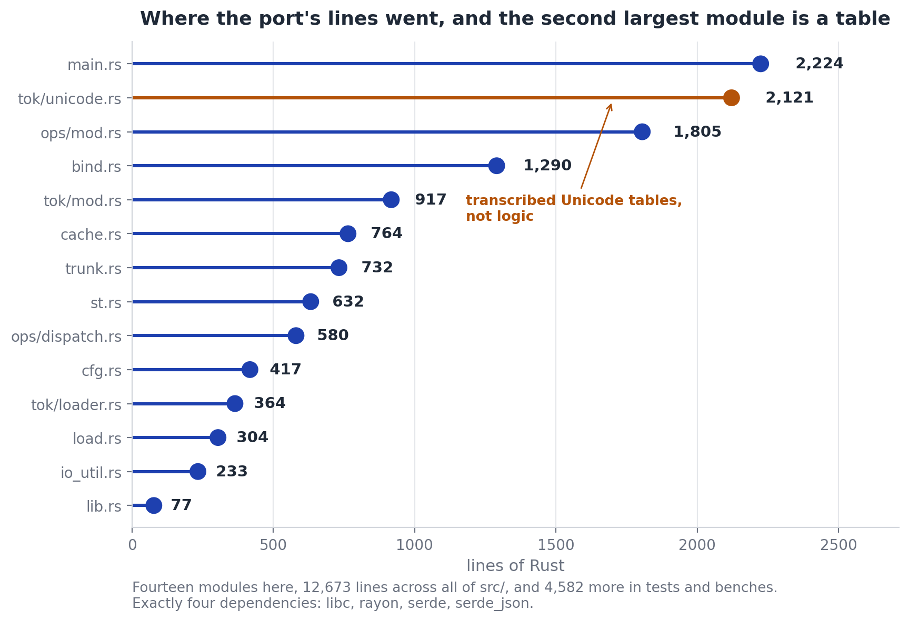
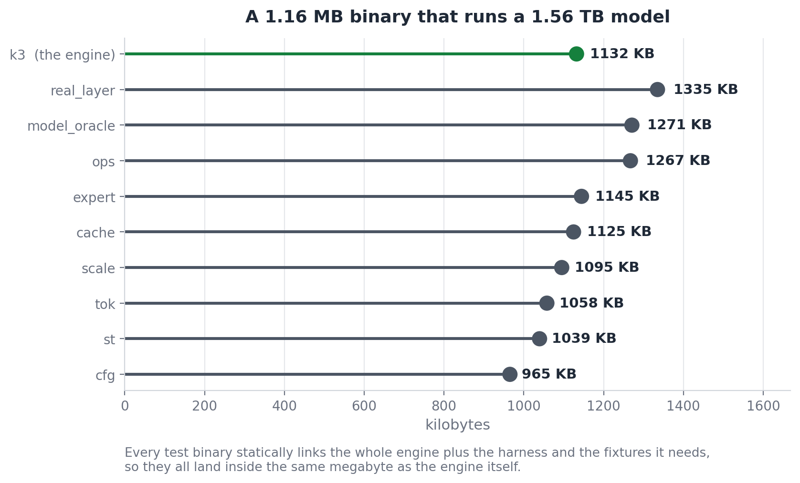

<div align="center">

<h1>kimi-k3-in-rust</h1>

<h3>A Rust port of <a href="https://github.com/FareedKhan-dev/kimi-k3-in-c">kimi-k3-in-c</a></h3>

<p><b>CPU inference for Kimi K3, a 2.78 trillion parameter mixture-of-experts LLM, in pure Rust.</b><br>
No GPU, BLAS, PyTorch, or ONNX.
Four dependencies.
Same 8 GB memory floor as the C original.</p>

<p>
<a href="../../actions/workflows/ci.yml"></a>
<a href="LICENSE"></a>
<a href="Cargo.toml"></a>
<a href="#platforms"></a>
<a href="#tests"></a>
<a href="#1-byte-identical-logits"></a>
</p>

</div>

## Start here

**Run the proof:**

```bash
cargo test --release
```

**Expected ending:**

```text
VERDICT: ENGINE MATCHES THE REFERENCE EXACTLY
test result: ok. 46 passed; 0 failed; 2 ignored
```

This takes about three seconds on an Apple M5.
It needs no model weights, network access, or Python.

**Build the binary:**

```bash
cargo build --release
```

The binary is `target/release/k3`.
The default build is portable; use `RUSTFLAGS="-C target-cpu=native" cargo build --release` to optimize for the current CPU.

## Pick what you need

- **Read the story first:** [What happened building this](#what-happened-building-this)
- **Run the model:** [Running it](#running-it)
- **See proof that Rust matches C:** [How we know it is the same engine](#how-we-know-it-is-the-same-engine)
- **See performance numbers:** [C against Rust, measured](#c-against-rust-measured)
- **Read porting details:** [What is different](#what-is-different)

> **Read the original for the model architecture.**
> [FareedKhan-dev/kimi-k3-in-c](https://github.com/FareedKhan-dev/kimi-k3-in-c) explains how the 2.78T model fits in 8 GB, MXFP4, KDA, MLA, trunk streaming, and expert caching.
> This README covers the Rust port.

---

## What this is

A statement-for-statement port of the C99 engine at commit [`ff11dce`](https://github.com/FareedKhan-dev/kimi-k3-in-c/commit/ff11dce858a2eb8a781224facdffd33a1fa48d25), including its CLI, tests, and benchmark.

It uses four dependencies: `libc`, `rayon`, `serde`, and `serde_json`.
It uses no BLAS, framework, or GPU.

**Current proof:**

- 55 tests pass, including the two that need the released checkpoint.
- Tiny-model logits are byte-identical to the C build on the same machine.
- **Released-checkpoint logits are byte-identical too**: all 163,840, on real weights.
- On real weights this port decodes 1.54x to 1.62x faster per token than the C build, on aarch64; expect parity on x86-64.
- **The full 93 layers ran on both engines at the same 8 GiB cap**: tokens equal, logits byte-identical, Rust 1.03x - a full-model token is ~80% disk wait, so the kernel gap mostly vanishes.
- CI checks Linux x86-64, macOS arm64, Clippy, formatting, and C-to-Rust bit identity.

> **Want the whole 93 layers?** That needs the full checkpoint on disk, 1,561 GB plus a
> 109 GB packed trunk, which is a storage bill rather than a memory one. The engine itself
> still runs in 8 GB of RAM. [`tools/rent_and_run.sh`](tools/rent_and_run.sh) does the whole
> thing on a rented box: clones both engines, pulls the checkpoint, builds, packs the trunk,
> then runs C and Rust at the same 8 GB ceiling and byte-compares. Sized for an
> `im4gn.xlarge` (arm64, 1,875 GB NVMe, about $0.36/hour). Run it on one arm64 box and
> one x86-64 box, both engines on each: arm64 tests whether the 1.6x holds on the full
> model, x86-64 tests the parity prediction. Splitting the two engines across two boxes
> would measure the storage instead, since the reference records a 2.2x device spread
> against a 1.6x effect.

> **Scope of the real-checkpoint run:** 3 of the 96 shards were downloaded, which is
> layers 0 and 1 plus the embedding and head, 24 GB rather than 1.56 TB. That is a real
> `--layers 2` stack on real bf16 weights and real MXFP4 experts, not the whole 93-layer
> model. Everything else here comes from the tiny model, synthetic models, and direct
> comparison with the C build. Point `K3_SHARD_DIR` at a shard set to reproduce.

<a id="platforms"></a>
Platforms: Linux and macOS, x86-64 and arm64.
Linux uses `O_DIRECT`, macOS uses `F_NOCACHE`, and other platforms use buffered reads.
Windows compiles and runs through the buffered path.

## What happened building this

The short version, in the order it happened. Everything here is expanded further down,
including inside the collapsed blocks.

1. **The port is byte-identical to the C build.** Not close: all 163,840 logits of the
   released model match to the byte, and so do the tiny-model oracle's 256.
   [Evidence](#how-we-know-it-is-the-same-engine).

2. **Then the C original turned out not to load the checkpoint on macOS at all.**
   `pread()` there rejects any request `>= 2 GiB` with `EINVAL` rather than returning
   short. Measured: 2,147,483,647 bytes succeeds, 2,147,483,648 fails. `embed_tokens` is
   `163840 x 7168` at bf16, 2,348,810,240 bytes, so the load dies at offset 0.

3. **Linux hides it.** There the same call caps at `0x7ffff000` and returns short, so the
   existing loop absorbs it, and every published run of the original is on Linux. The port
   is immune because `read_at` clamps before the syscall. One line to fix; it is not my
   repo, so it ships as [a patch](docs/patches/) (finding 6).

4. **I shipped a worse bug than that one.** C splices the `language_model.model.` prefix
   into 39 separate string literals. This port hoisted it into one helper and then did not
   apply it, so the binder asked for `layers.0.input_layernorm.weight` and bound **zero
   layers of the real model** (finding 4).

5. **Every test passed anyway, because the suite is weightless by design.** The C
   project's own `make test` ends by printing `ALL WEIGHTLESS TESTS PASSED`. The
   full-model oracle builds its own weight store from fixture names and never calls the
   binder; the only two tests that would have caught it are gated on a 1.56 TB download.
   A name bug had nothing standing under it.

6. **Fixed, with an ungated test under it now.**
   [`tests/bind_names.rs`](tests/bind_names.rs) drives the real planner against a shard set
   holding no layer tensors and asserts the name it asks for. Then the real weights turned
   out to be reachable after all: the shards hold one layer each, so 3 of 96, 24 GB rather
   than 1.56 TB, is enough for a real two-layer stack.

7. **On those real weights it decodes 1.54x to 1.62x faster than C.** That is an aarch64
   number and the caveat matters: the gap is entirely the bf16 unpack, where the original
   left aarch64 to the autovectoriser and this port hand-wrote NEON. On x86-64 both
   hand-write intrinsics and the instruction mix is identical, so expect parity.
   [Numbers](#c-against-rust-measured).

8. **Then the full 93 layers, on a rented box, killed it.** Not the C build - this one. At
   the 8 GiB ceiling the original is built around, C completed and the port was OOM-killed
   at `anon-rss 7.984 GiB`, over by 16 MiB. The cause was indexing: the real checkpoint
   holds 497,220 tensors, and this port was paying 415 bytes each to C's ~130, because
   every tensor had a heap-allocated name, a heap-allocated shape, and a *second* copy of
   the name as a hash key. Now 216 bytes, by adopting what C already did - inline
   `shape[4]`, one FNV-keyed table, names stored once.
   [How it was measured without renting anything](#reproducing-the-oom-on-a-laptop).

9. **It kept dying anyway, and the real bug was better.** The index fix was necessary but
   not sufficient: a 12 GiB diagnostic run measured true anonymous demand at 10.70 GB
   against an 8.47 GB plan, and an `mmap` trace with stacks caught the port loading the
   2.35 GB embedding **twice** - once for the model, once for a `--draft` mode that was
   not even enabled. C aliases that buffer inside the draft branch (`dw.mb = w.mb`,
   k3_run.c:1135); the port had hoisted it out and made it a copy. One `Arc` later, all
   93 layers run at the same 8 GiB cap as C: **74.46 s/token C, 72.47 Rust, tokens equal,
   all 163,840 logits byte-identical.** The speedup is 1.03x and the honest reason is
   that a full-model token on this box is ~80% disk wait; the kernel gap only shows where
   compute matters. [The full result](#reproducing-the-oom-on-a-laptop).

14,430 lines of Rust (blanks and comments excluded), four dependencies, a 1.16 MB binary.

## Running it

The CLI surface is the original's, flag for flag, including exit codes and the wording of
every refusal. Anything the original's
[README](https://github.com/FareedKhan-dev/kimi-k3-in-c#usage) or
[QUICKSTART](https://github.com/FareedKhan-dev/kimi-k3-in-c/blob/main/docs/QUICKSTART.md)
says about invoking `k3` applies here:

```bash
k3 <model_dir> --trunk <packed_trunk> --preset laptop \
   --tok <model_dir> --prompt "The capital of France is" --gen 8 --incremental
```

Same presets (`auto`, `laptop`, `desktop`, `workstation`, `server`, `max`), same
`--incremental` / `--spec` / `--draft-trunk` decode paths, same `--save-state` /
`--load-state` on-disk format, same `k3_run.json`. `--help` is the source of truth.

The original's Python tooling works unchanged and is vendored in `tools/`: `tok_parity.py`
runs against the `k3-tok-test` binary this crate builds for exactly that purpose, and
`cmp_logits.py` against `--dump-logits` output. `scripts/download-model.sh` and
`scripts/pack-trunk.sh` live in the original and are not duplicated.

Two environment variables are new, and neither changes results:

| variable | effect |
|---|---|
| `RAYON_NUM_THREADS` | thread count, the `OMP_NUM_THREADS` analogue |
| `K3_EXPERT_LAYER` | which layer `tests/expert.rs` reads (default 1) |

`K3_NOHUGE`, `K3_NO_BATCH_PREFILL`, `K3_SHARD_DIR` and `K3_TOK_FILES` behave as they do in
the original.

---

## What is different

Skip this section if you only want to build or run the engine.

<details>
<summary><strong>Show 10 implementation differences</strong></summary>


### 1. The numeric core carries explicit NEON and AVX2

This is the substantial change. The original has three paths that must agree bit for bit -
scalar, OpenMP and AVX2 - and it hand-writes the AVX2 intrinsics while leaving other
architectures to the compiler.

The port started with one generic body per kernel, stamped out under
`#[target_feature(enable = "avx2,fma")]`, on the theory that the fixed lane partition and
the explicit reduction tree were enough to keep the vectoriser honest. Two things went
wrong, and both are worth recording:

- **The x86-64 dispatch never compiled.** A `#[target_feature]` function can only be
  coerced to an *unsafe* function pointer, because calling one on a CPU without the feature
  is undefined behaviour. With safe `fn` pointers in the dispatch table the AVX2 arm failed
  to typecheck, and the only reason the crate still built is that the arm is behind
  `#[cfg(target_arch = "x86_64")]`. On an x86-64 host it would have been a compile error;
  had the types been looser it would have been a silent scalar fallback.
- **rustc did not vectorise where clang did.** The generic 16-accumulator body compiled to
  17 scalar `fmadd` on aarch64, against clang's 8 `fmla.2d` from the same algorithm.
  Removing bounds checks with `chunks_exact`, then fixed-size array references, then
  splitting the widening from the accumulation, all failed to move it.

So `src/ops/dispatch.rs` now holds three implementations of each hot kernel: a portable
body, an `avx2` module mirroring the original's intrinsics one for one, and a `neon` module
with the same lane mapping worked out for 2-lane `float64x2_t`. The dispatch table holds
`unsafe fn` pointers and is populated once behind a `LazyLock`, with `select()` the only
place that installs a feature-gated kernel and only after `is_x86_feature_detected!` agrees.

The lane algebra is in the module docs. For NEON the sixteen scalar accumulators become
eight vectors with `u[m] = (a[2m], a[2m+1])`, and the original's reduction tree
`b0 = (a0+a4)+(a8+a12)` falls out as `(u0+u2)+(u4+u6)` lanewise, associated in the same
order, so `vaddvq_f64` of that is exactly `b0+b1`. Same arithmetic, same rounding, same
bits - which the [logits comparison](#1-byte-identical-logits) then confirms end to end,
and which the [instruction counts](#4-codegen-parity) confirm at the disassembly.

### 2. Scratch disjointness is enforced, not documented

The original threads one caller-owned `float *scratch` through every kernel and carves it
with pointer arithmetic. Its comments are emphatic about the hazard, and specific:

> Every region below is DISJOINT and must stay so. Overlapping any two of them can appear
> to work, aliasing the gate buffer onto q, say, is safe only while `H*vh < H*qh` holds, but
> that is an accident of the released dimensions, not an invariant.

The port carves the same regions in the same order with `split_at_mut`, so that comment
becomes a compile error instead of a warning. The offsets are unchanged; only the
enforcement is. The same applies to the MoE scratch, the KDA scratch and the decoder
layer's block-residual stack.

One consequence worth knowing: kernels the original calls with the same pointer twice
(`k3_rmsnorm(accL, accL, ...)`) get an explicit in-place variant here - `rmsnorm_ip`,
`kda_decay_ip`, `shortconv_ip` - documented as computing identically because the scale is
derived from the whole vector before any element is written.

### 3. Tagged pointers became types

The original stores a weight matrix as a `const void *` plus an `int wdt` tag, and opens
with a warning in capitals:

> ZERO-INITIALISE EVERY WEIGHT STRUCT BEFORE FILLING IT. An uninitialised stack struct
> therefore does not merely read wrong weights, it jumps to a garbage address.

Here that is:

```rust
pub enum WMat<'a> { F32(&'a [f32]), Bf16(&'a [u16]), I8R(&'a [u8]) }
```

and the "exactly one of `kda`/`mla` is non-NULL" rule is an `enum Attn`. The `memset`-first
discipline is not a rule the reader has to remember, and the tag cannot disagree with the
pointer. `Option<WMat>` carries the NULL-selects-a-path cases (dense versus MoE, gated
versus ungated MLA) explicitly.

### 4. The expert source is a trait, passed as an argument

`K3ExpertSrc` is a struct of function pointers stored inside `K3MoeW`, which the MoE kernel
then calls through - so a read-only weight struct owns a mutable cache. The port makes it a
trait object threaded as its own parameter:

```rust
fn moe(..., w: &MoeW, ..., src: Option<&mut dyn ExpertSrc>)
```

`get` returns `Option<ExpertQ<'_>>`, borrowing the source, which is exactly the original's
documented contract ("must leave the returned pointers valid until the caller finishes")
now expressed in the signature. `get_many` and `resident` are default methods, so the
"may be NULL, and callers MUST cope" comment becomes the default implementation.

### 5. serde_json replaces the hand-written scanner

The original hand-rolls a JSON scanner (`third_party/json.h`) and an FNV-1a open-addressed
hash table over 497,220 tensor names. The port uses `serde_json` and `HashMap`.

This is strictly safer in one respect the original notes about itself: its parser stores
numbers as `double`, which is exact only below 2^53, and safetensors offsets are byte
counts into a 1.56 TB file. `serde_json` gives `i64`. Observable behaviour is otherwise
identical - duplicate tensor names still hard-error, absent names still return `None`, the
shard scan is still in sorted filename order - and `tests/st.rs` asserts the same six named
tensors the original's Makefile does.

The one behaviour not reproduced: the C scanner turns non-ASCII `\uXXXX` escapes into `?`.
No tensor name in the checkpoint or the fixtures has one.

### 6. rayon replaces OpenMP

Legal for the same reason the original gives for OpenMP: every parallel loop writes only its
own output element, and the accumulation order *inside* a row is untouched, so results are
identical at any thread count. The `if (out > 64)` serial thresholds on the pragmas are kept
as explicit branches. `RAYON_NUM_THREADS` stands in for `OMP_NUM_THREADS`.

The expert cache's three-phase batch prefetch keeps its shape: serial reserve marking slots
INFLIGHT, parallel reads sorted by `(shard, offset)`, serial publish of only the reads that
completed. The parallel phase writes into distinct slots of one arena through a small
`SlotWriter`, and the safety argument the original makes in a comment is attached to the
`unsafe` block here.

### 7. Errors are values, and aborts stay aborts

Library functions return `std::io::Result`. But where the original deliberately calls
`abort()`, the port panics with the same message, because the reasoning transfers exactly:

> These kernels return void, so a failed allocation could only be handled by returning
> early, which leaves the output buffer holding whatever was in it before, and the caller
> consumes it as a result. The run then completes and prints a plausible token computed
> from uninitialised memory.

So `k3_fatal_oom` and `k3_fatal_bound` become panics carrying the original text, and the
MLA KV-cache bound check is still a hard stop rather than a `Result`. Rust's allocator
aborts on OOM by itself. A dropped routed expert is still counted rather than fatal, and
still exits 4, because that decision belongs to the caller.

### 8. Where the unsafe is

65 uses of the keyword, concentrated where the original is doing something the borrow
checker cannot see:

| module | uses | what |
|---|---|---|
| `bind.rs` | 15 | reinterpreting a layer blob's bytes as `&[f32]` / `&[u16]` at recorded offsets |
| `ops/dispatch.rs` | 14 | the NEON and AVX2 intrinsics, plus the `unsafe fn` dispatch table |
| `io_util.rs` | 10 | the aligned/hugepage allocator, `O_DIRECT`, `F_NOCACHE`, `madvise` |
| `main.rs` | 7 | `getrusage`, and the state file's raw header layout |
| `trunk.rs` | 7 | the ring arena the reader thread writes while the main thread computes |
| `ops/mod.rs` | 6 | calling through the dispatch table |
| `cache.rs` | 4 | the parallel phase of the batch prefetch |
| `st.rs` | 2 | positioned reads into an aligned buffer |

Every block has a safety comment. The allocator is the only place that owns raw memory;
everything else borrows from it.

### 9. What is deliberately identical

Not "similar" - identical, and tested:

- **Every reduction order.** The 16-lane and 8-lane partitions, the `(b0+b1)+(b2+b3)` trees,
  and the tail loops. `fma(a,b,c)` is `a.mul_add(b, c)`; a plain `a*b + c` stays two
  operations. Never one where the original has the other.
- **Every cast point.** `sc[s] = (float)d * scale` narrows before the f32 multiply here too.
- **The E8M0 and E2M1 tables**, including the low-nibble-is-even convention and 255-is-zero.
- **The three model invariants**, each restated at its point of use: `A_log` per head, NoPE
  slots retained and cached, routing bias steering selection only.
- **The tokenizer**, down to the GPT-2 `byte2str` map being built before any key, the
  `rankbpe = 1` merge rule, and the Kimi pretokenizer's leading-Han-run rule. The two
  unicode classification tables are transcribed entry for entry rather than swapped for a
  crate, because parity is byte-for-byte.
- **The on-disk state format** (`"K3ST"`, version 1), the `k3_run.json` shape, the cache
  histogram JSON and the `(layer, expert)` trace.
- **The fixtures**, copied verbatim from the original's `tests/fixtures/`.

### 10. What is not ported

- The original's `docs/` prose and its `docs/data/` captures. Those are its measurements on
  its hardware; re-hosting them here would imply this port produced them. Links instead.
- The three I/O timing regimes in `test_expert.c` (sequential cold, random cold, warm). They
  need `/proc/sys/vm/drop_caches` and root, and they measure the storage device.
- The 93-layer conformance sweep and the torch comparison harness, which need the checkpoint
  and a PyTorch install. `tests/expert.rs` and `tests/real_layer.rs` are the checkpoint-gated
  equivalents.
- Scope limits are unchanged and are the original's: no chat template, greedy only, no
  chunked prefill, no vision tower, no quality benchmark.

</details>

---

## How we know it is the same engine

<a id="tests"></a>



**It is the C project's suite, not a new one.** `fixtures/` is a verbatim copy of the
reference's `tests/fixtures/` - `diff -rq` between the two trees is clean - so the oracle
targets are the same integers, not merely equivalent ones. Each C test binary has one Rust
counterpart, and the same two are gated on a real checkpoint in both projects:

**Proof at a glance:**

1. The tiny-model logits are byte-identical to the C build: 256 f32 values and 1,024 matching bytes.
2. Teacher forcing, greedy decode, and incremental decode match every expected token.
3. The kernel fixtures preserve the original reduction order, cast points, and tolerances.

<details>
<summary><strong>Show exact verification evidence</strong></summary>


```text
C `make test`      Rust `cargo test`   fixture
test_ops           ops.rs              fixtures/ops           per-kernel, from pure torch
test_cache         cache.rs            fixtures/cache
test_st            st.rs               fixtures/st            two synthetic shards
test_cfg           cfg.rs              fixtures/cfg           one accept, three refusals
test_tok           tok.rs              -                      gated: needs tiktoken.model
scale_test         scale.rs            -                      real 93-layer dimensions
k3_model           model_oracle.rs     fixtures/ref_k3.json   the three gates below
test_real_layer    real_layer.rs       -                      gated: K3_SHARD_DIR
test_expert        expert.rs           -                      gated: K3_SHARD_DIR
-                  bind_names.rs       -                      added here; see finding 4
```

Neither project loads the 1.56 TB checkpoint to test. The C target says so in its own last
line, `ALL WEIGHTLESS TESTS PASSED`. What stands in for the real model is a complete but
tiny one, and [finding 4](#things-the-port-turned-up) is what that costs.

### 1. Byte-identical logits

The strongest check. The tiny-model oracle's final-position logits, dumped from both
binaries on this machine and compared with `cmp`:

```console
$ cd ~/Dev/kimi-k3-in-c && K3_DUMP_LOGITS=/tmp/c_logits.bin ./bin/k3_model tests/fixtures
VERDICT: ENGINE MATCHES THE REFERENCE EXACTLY
dumped 256 final-position logits to /tmp/c_logits.bin

$ cd ~/Dev/kimi-k3-in-rust && cargo test --release --test model_oracle
VERDICT: ENGINE MATCHES THE REFERENCE EXACTLY
logits dumped to target/rust_logits.bin

$ cmp /tmp/c_logits.bin target/rust_logits.bin && echo IDENTICAL
IDENTICAL
```

256 f32, 1024 bytes, no difference. The C side needed a two-line patch to dump the vector;
that patch is not committed to the original.

#### On the released checkpoint

The tiny model is 256 logits wide. The real one is 163,840, and the same comparison holds
there, on real bf16 trunk weights and real MXFP4 experts streamed from actual shards:

```console
$ A="~/k3model --ids 1,2,3,4,5,6,7,8 --gen 3 --layers 2 --incremental --cache-gb 1"

$ ./target/release/k3 $A --dump-logits /tmp/real_rust.bin --out /tmp/real_rust.json
config: ~/k3model/config.json (nested shape) | hidden=7168 layers=93 vocab=163840
        | 24 MLA + 69 KDA | experts 896 top16 shared2 | latent=3584
bound 2/2 layers                       3 tokens in 3.7 s, 1.25 s/token

$ ../kimi-k3-in-c/bin/k3 $A --dump-logits /tmp/real_c.bin --out /tmp/real_c.json
bound 2/2 layers                       3 tokens in 3.7 s, 1.22 s/token

$ cmp /tmp/real_c.bin /tmp/real_rust.bin && echo IDENTICAL
IDENTICAL
```

163,840 f32, 655,360 bytes, no difference, and the same three token ids
(`8736, 152366, 136640`). The two checkpoint-gated tests agree just as exactly: their
`real_layer.json` outputs are byte-identical at 1,549,270 bytes, as are their
`expert_trace.bin` cache traces, and both report `max |y| = 0.084896`.

`tests/expert.rs` also confirms the MXFP4 geometry against the real thing rather than a
fixture: all 896 routed experts of layer 1 are contiguous, each exactly 17,547,264 bytes,
`33,030,144` parameters at `0.531250` bytes per parameter, which is what MXFP4 predicts to
the digit. The fused matmul and dequantise-then-multiply agree at `0.000e0`.

This is a 2-layer stack, not all 93. See the scope note in
[What this is](#what-this-is).

### 2. The three oracle gates

13 layers, hidden 128, vocab 256, 628 tensors. Thirteen is not arbitrary: at the tiny
model's `attn_res_block_size` of 3 it puts attention-residual boundaries at layers 0, 3, 6,
9 and 12, which is five snapshots and four complete blocks - enough for the failure modes
that only appear once blocks close. The released model gets the same structure from 93
layers at block size 12. All three gates exact, and the same verdict from the C binary on
the same fixtures:

```text
GATE 1  teacher forcing : 32/32 positions match tf_pred
        generated span  : 20/20  <- must be exact
GATE 2  greedy decode   : 20/20 generated tokens match full_ids
GATE 3  incremental    : 20/20 generated tokens match full_ids  <- KV cache + carried KDA state
```

### 3. The kernel fixtures

18 tests over the original's fixture set, with tolerances read from its `MANIFEST.json` and
a skip counted as a failure, as it is there. Two exactness tests replace what the original
got from its `#ifdef` matrix: `matmul_bf16` against `matmul` on synthetic data compared with
`to_bits`, and each dispatched kernel against a reference dot product written in the test
that reproduces the lane partition and tree independently.

### 4. Codegen parity

Same instruction mix as the original on this machine, because the lane mappings match:

```text
aarch64, fmla.2d per kernel        x86-64, vfmadd*pd per kernel
kernel          C     Rust         kernel          C     Rust
matmul          8     8            matmul          4     4
matmul_bf16     8     8            matmul_bf16     4     4
matmul_mxfp4    4     4            matmul_mxfp4    2     2
total          20    20
scalar fmadd    3     3
```

</details>

---

## C against Rust, measured

Both builds on one machine (Apple M5, 10 cores), at their real settings: C with
`clang -O3 -mcpu=native -ffp-contract=off` and OpenMP through libomp, Rust with
`opt-level = 3`, thin LTO and rayon. Thread count pinned per run with `OMP_NUM_THREADS` and
`RAYON_NUM_THREADS`.

**Read the result first:** on the released checkpoint this port decodes **1.54x to 1.62x**
faster per token than the C build, steady across thread counts. Two scope limits travel
with that number and should never be dropped from it: it is an **aarch64** result, because
it comes from a kernel the original left to the autovectoriser and this port hand-wrote
(on x86-64 both hand-write intrinsics and the instruction mix is identical, so expect
parity), and it is **two layers of 93**, so it does not project onto a full token, where
storage dominates - [the full 93-layer measurement](#reproducing-the-oom-on-a-laptop) came
in at **1.03x** with byte-identical logits, both engines inside the same 8 GiB cap. On a synthetic f32-only model the same harness measures only 1.14x to
1.38x, and that gap is itself a finding - see
[why the synthetic number was low](#why-the-synthetic-number-was-low).

### The released checkpoint

Layers 0 and 1 of 93, on real bf16 trunk weights and real MXFP4 experts streamed off disk.
Three of the 96 shards, 24 GB. Both binaries read the same shards and emit identical token
ids, checked before any timing.



```text
threads      C s/tok    Rust s/tok    speedup        (minimum of 7 runs)
      1       0.8271        0.5203      1.59x
      2       0.4693        0.2994      1.57x
      4       0.3025        0.1967      1.54x
     10       0.2320        0.1430      1.62x
```

**These are minima, not medians, and the distinction is not cosmetic.** The shard set is
24 GB on a 24 GB machine, so the page cache cannot hold it and every run does real disk
reads. That puts long stalls in the distribution: Rust's one-thread median is 1.24 s
against a 0.52 s floor, and a median-of-medians briefly reported Rust *losing* at four
threads on the strength of a single bad run. The minimum is the run least disturbed by
storage, which is the one that compares the code. The medians are drawn on the chart as
caps so the spread stays visible. Raw data:
[`docs/data/real-checkpoint.csv`](docs/data/real-checkpoint.csv).

<a id="reproducing-the-oom-on-a-laptop"></a>
#### All 93 layers, and the OOM that came with them

The two-layer figures above are the shipped comparison. The full model was then run once on
a rented `im4gn.4xlarge` (16 vCPU Graviton2, 1.875 TB local NVMe) against the whole 1.56 TB
checkpoint, at the `MemoryMax=8G` ceiling the original is built around. **C completed. This
port did not.**

```text
C, 93 layers, 8 GiB cap
  8 tokens in 596.1 s, 74.51 s/token
  PEAK RSS 8.28 GB
  1472 expert requests, 25.83 GB read per token
  I/O share of wall clock: 78.1%   (trunk 364.2 s + experts 101.1 s)

Rust, same box, same cap
  Memory cgroup out of memory: Killed process 7040 (k3) anon-rss:8371976kB
```

7.984 GiB against an 8 GiB cap: over by **16 MiB**. C's own figures land where the
reference says they should - 1472 requests and 25.83 GB per token - so the box was fine and
the port was not.

The cause was the index, and it did not need a rented machine to find. `St::open` reads
only the JSON header at the front of each shard and never touches tensor data, so a
**sparse header-only replica** stands in for the checkpoint: real names from
`model.safetensors.index.json`, real shapes sampled from the shards already on disk, each
file truncated to its full logical length so the reader's EOF check still passes.

```text
logical  1.589 TB   <- what the reader sees
on disk     76 MB   <- sparse holes cost nothing
```

That reproduces the real 497,220-tensor index on a laptop, and
[`tools/measure_index.rs`](tools/measure_index.rs) weighs it:

```text
                index cost    per tensor
before              206 MB    415 bytes
after               107 MB    216 bytes
C, for reference     ~65 MB    ~130 bytes
```

Every tensor was paying for a heap-allocated name, a heap-allocated `Vec` shape, and a
*second* copy of the name as a `HashMap<String, _>` key. C pays for none of those: an arena
behind an open-addressed FNV table (`k3_st.c:64`), with an inline `int64_t shape[4]`. The fix adopts all
three - inline `[i64; 4]`, one `fnv1a`-keyed table with hits confirmed against the stored
name, `Box<str>` - which is both smaller and closer to the original.

**The full model then ran, and the result is the strongest in this README.** After the
index fix, one more OOM at the same cap forced the real hunt: a 12G diagnostic run
measured true anonymous demand at 10.70 GB against an 8.47 GB plan, a `/proc/PID/maps`
snapshot showed one unplanned 2.35 GB block sized exactly vocab × hidden × bf16, and a
`bpftrace` trace on `mmap` with user stacks caught `ModelBind::load` running **twice** -
the second time for the hybrid-draft path, which C only ever aliases
(`k3_run.c:1135: dw.mb = w.mb`) and only inside the `--draft` branch. The port had turned
a conditional alias into an unconditional second copy of the embedding. `Weights.mb` is
now `Arc<ModelBind>` and the draft clones the Arc.

With that gone, all 93 layers fit and ran at the same `MemoryMax=8G` the C build uses:

```text
93 layers, 1.56 TB checkpoint, 8 GiB cap, im4gn.4xlarge (16 vCPU Graviton2)

          s/token   peak RSS   I/O share of wall clock
C         74.46     8.28 GB    78.0%
Rust      72.47     8.34 GB    82.8%

tokens: identical    logits: byte-identical    speedup: 1.03x
```

([`docs/data/full-model.csv`](docs/data/full-model.csv))

Three things this measures, in order of importance:

1. **The exactness contract holds at full scale.** All 163,840 final logits byte-identical
   and every generated token id equal, through 93 layers, 870 GB of streamed trunk reads,
   and 16,223 expert loads. The tiny-model byte-identity was the design gate; this is the
   same property on the real 2.78T-parameter artifact.
2. **The 8 GB claim now holds for the port** - 8.34 GB peak against C's 8.28, the ~60 MB
   difference being the larger tensor index. It took three real bugs to get here (the
   index memory, a guard comparing against the wrong limit, the draft double-load), each
   documented above and in the commit history.
3. **The speedup is 1.03x, and quoting anything else would be dishonest.** A full-model
   token on this box is ~80% disk wait - 870 GB of trunk plus 25.8 GB of experts read per
   8 tokens - and both engines read the same bytes at nearly the same rate. The kernel
   advantage that gives 1.54-1.62x on the two-layer stack (40-60% I/O) dilutes to almost
   nothing when the disk is the bottleneck, exactly as the Amdahl paragraph below
   predicts. Faster storage widens the gap; this disk closes it.

**Why 1.03x is signal and not noise.** Three independent checks:

- The saga's failures left behind five C full-model runs on this instance type; the port
  ran twice, once at the 8 GiB cap and once at a 12 GiB diagnostic cap.

  ```text
  C    74.46  74.48  74.49  74.51  74.54    spread 0.08 s  =  0.11%
  Rust 72.47  72.48                         spread 0.01 s
  gap   2.02 s/token  =  2.71%   ->   25x the C spread
  ```

  The spread is tiny because the workload is structurally deterministic: trunk reads use
  O_DIRECT, so no page-cache state carries between runs - every run reads the same
  870.5 GB in the same fixed layer order at the same ~2390 MB/s.
- The decomposition points the same way, but it has two terms and quoting only one would
  overstate it. By each run's own accounting, per 8 tokens: compute is C 130.7 s against
  Rust 99.5 s, **31.2 s in the port's favour (1.31x)** - the two-layer kernel advantage
  showing up again. I/O wall is C 465.0 s against Rust 480.3 s, **15.3 s the other way**
  on the same bytes (the port's trunk reads attribute at 2358 MB/s to C's 2392). Net:
  15.9 s, the 2.02 s/token measured. Two caveats travel with this split: each engine
  draws its own I/O-versus-compute boundary, so the attribution is self-reported, and it
  comes from one run pair. The 1.03x headline rests on the whole-token clocks above,
  which need neither caveat.
- The logits are byte-identical, so the two timings measure exactly the same arithmetic
  on the same inputs. There is no workload variance for a timing artifact to hide in.

[`tools/rent_and_run.sh`](tools/rent_and_run.sh) reproduces the whole measurement end to
end on a rented box, and leaves the box up on failure so the 1.56 TB checkpoint survives
for a retry - stopping used to discard the instance store, which turned any late failure
into another 2.5-hour download.

<a id="why-the-synthetic-number-was-low"></a>
#### Why the synthetic number was low

The synthetic model below reports 1.14x to 1.38x, and it is not measuring the same thing.
A dtype census explains the whole difference:

```text
                    tensors
synthetic model     340 F32, 576 U8      <- no bf16 at all
real shard          17 BF16, 6 F32       per layer
```

`tools/gen_bench_model.py` writes every non-expert tensor as F32, so the synthetic run
never executes `matmul_bf16` - the one kernel where the two builds diverge, and where
[the unpack](#the-two-hot-kernels) makes Rust about 2x. The synthetic benchmark was
therefore timing the kernels on which both languages emit identical instructions, which is
why it also narrowed toward parity as threads went up. It is kept below because it is fully
reproducible without a 24 GB download, but the released-checkpoint figure is the real one.

### The synthetic model

Two matmuls are not an engine. This runs the complete decode loop - the KDA recurrence,
gated MLA with a KV cache, the attention-residual stack, the router, MXFP4 experts streamed
through the LRU cache - and times the part a user waits on.

Downloading all 96 shards was not practical, so this measurement runs a synthetic
checkpoint with the same layer mix and the same kernel shapes at hidden size 2048: 13
layers, 9 KDA, 4 MLA, one dense, twelve MoE, eight routed experts each. Weights are random,
because what is being compared is arithmetic throughput and not model quality. Every
non-expert tensor is F32, which is the limitation described above.

**Both binaries read the same bytes and emit identical token ids**, which the harness
asserts before reporting any timing. Per-step seconds come from the engine's own STEP table,
so checkpoint load is excluded, and step 0 is dropped because prefill scales with the prompt
rather than with one token.



```text
threads      C s/tok    Rust s/tok    speedup
      1       0.0951        0.0687      1.38x
      2       0.0589        0.0476      1.24x
      4       0.0529        0.0453      1.17x
     10       0.0550        0.0480      1.14x
```

The gap narrows with thread count here, unlike on real weights, because with no bf16 in
play both builds run the same instructions and just hit the same memory wall. Raw data:
[`docs/data/end-to-end.csv`](docs/data/end-to-end.csv). Reproduce with
`tools/gen_bench_model.py` then `tools/bench_end_to_end.py`.

**Neither ratio carries over to the full 93-layer model.** Both measurements above hold the
weights close: the synthetic one is resident in RAM, and the real one touches two layers.
The full model streams 93 layers at hidden 7168 from disk, and the reference's own 12-rung
ladder puts 40.9-60.6% of wall clock in storage waits
([`memory-ladder.tsv`](https://github.com/FareedKhan-dev/kimi-k3-in-c/blob/main/docs/data/memory-ladder.tsv)).
No language touches that half. Amdahl on the arithmetic half, at the measured 1.54-1.62x:

```text
I/O share of a real token    1.62x arithmetic    1.54x arithmetic
                    40.9%               1.29x               1.26x
                    60.6%               1.18x               1.16x
```

So the defensible claim: **the port does not pay for its safety on the hot path, and is
about 1.6x ahead of the C build on real weights at these widths.** The projection above
said a whole 93-layer token would land nearer 1.16-1.29x; [the measurement
came in at 1.03x](#reproducing-the-oom-on-a-laptop), because this box spends 78-83% of a
full-model token in storage waits - above even the ladder's 60.6% top rung - and the
compute half's measured 1.31x dilutes accordingly. The projection's structure was right,
its I/O share was optimistic, and the disk is still the thing to fix first.

Peak RSS is at parity - 2.02 GB against 2.01 GB on this model, measured the same run.

### The two hot kernels

**The two builds are shown to be doing the same work first.** Both benchmarks fill inputs
from the same xorshift32 with the same seeds, and hashing the output vectors gives
`6c14a49941ce86d9` (bf16) and `a231061237b5579d` (mxfp4) on both sides. Without that check a
timing comparison is comparing two workloads. Raw data:
[`docs/data/perf-sweep.csv`](docs/data/perf-sweep.csv).



```text
                     one core                    all 10 cores
bf16 matmul   C  18.58 ms   9.5 GFLOP/s     C  4.33 ms  40.7 GFLOP/s
12288 x 7168  R   9.21 ms  19.1 GFLOP/s     R  1.81 ms  97.2 GFLOP/s    Rust 2.0x / 2.4x

MXFP4 matmul  C   2.39 ms   9.2 GFLOP/s     C  0.56 ms  39.4 GFLOP/s
3072 x 3584   R   2.42 ms   9.1 GFLOP/s     R  0.57 ms  38.6 GFLOP/s    a tie
```

MXFP4 lands on parity, which is what an identical instruction mix predicts and is the result
that should be there. bf16 is the one that moves, **and it is already 2x at one core**, so it
is not a threading effect:



Neither threading runtime is the story. Both scale the same way and both flatten past six
cores, which is the memory-bandwidth wall this engine is designed around:



So where does the bf16 2x come from, when both kernels issue exactly 8 `fmla.2d`? The bf16
unpack. Disassembling the two kernel bodies:



```text
                        load   bf16->f32   f32->f64   vector FMA   total
C    k3_matmul_bf16       20          16         16            8      60
Rust neon::dot_bf16        7           4         16            8      35
```

The arithmetic is identical: 8 vector FMAs and 16 lanes of `f32 -> f64` widening either way.
The whole difference is getting bf16 values into registers. From the C source's scalar
`k3_bf16f()` expression clang emitted 2-lane `shl.2s` shifts with per-halfword `mov.h`
inserts fed by a deinterleaving `ld2.2s`; the hand-written NEON does one `shll.4s` per four
elements off a plain `ldp`.

**The speedup is real, and it is this port's.** On this machine, on real weights, tokens
come out 1.54x to 1.62x faster, and that traces to this kernel. The real trunk is bf16, so
`matmul_bf16` runs on every layer; it is diluted to 1.6x from the kernel's 2x because the
KDA recurrence, the router and the expert dequantisation are code where the two builds
agree instruction for instruction. The synthetic run cannot show any of it, because it
holds [no bf16 at all](#why-the-synthetic-number-was-low).

**What earned it was doing the aarch64 work, not choosing Rust.** The original hand-wrote
AVX2 and left aarch64 to the autovectoriser, which picked a poor unpack on this one kernel.
This port hand-wrote the NEON. The same intrinsics in C would close the gap, and nothing
here says otherwise.

That has a consequence worth stating before anyone quotes 1.6x at you: **on x86-64 both
projects hand-write their intrinsics, the instruction mix is identical** (4, 4 and 2
`vfmadd*pd`, see [codegen parity](#4-codegen-parity)), **so expect parity there, not 1.6x.**
The measured advantage is an aarch64 result. It has not been measured end to end on x86-64.

---

## Things the port turned up

**Six findings are grouped below.**
The fixed items remain documented as failure notes for future ports.

<details>
<summary><strong>Show all six findings</strong></summary>


1. **`bench_kernels.c` uses a truncated FNV offset basis.** It carries
   `1469598103934665603`; the FNV-1a 64-bit basis is `14695981039346656037`, one digit
   longer. The hash is still a perfectly good fingerprint, but it is not FNV-1a. The Rust
   benchmark prints both so its output can still be diffed against the original's.

   Then this port shipped the same class of bug into `st.rs`, in the commit that claimed
   parity with C's hash: `0x1000_0000_01b3` for the FNV prime, one zero too many, 16x the
   real value. Still a valid hash, still passed every test, still not FNV - and the doc
   comment next to it asserted otherwise. The constants are now written as decimal exactly
   as C spells them, and `fnv1a_matches_published_vectors` pins all three published vectors
   plus two real tensor names hashed by C's own function. **A constant nothing tests is not
   a constant, it is a guess**, and hex grouping is where FNV in particular goes wrong.
2. **The `#[target_feature]` dispatch trap.** Documented in
   [section 1](#1-the-numeric-core-carries-explicit-neon-and-avx2) because anyone
   multiversioning kernels in Rust will hit it.
3. **Three bugs in this port's own generated tests**, all found by running them and all
   fixed by trusting the C source over the test: an `l2norm` expectation that divided by
   `sqrt(5)` where its own comment said 25; a `kda_layer` state comparison that used the
   buffer length instead of the fixture's, where the original compares the fixture's; and a
   `layer_kda` case that left the KDA gate weight unwired because `g` and `o` are shared
   struct fields. Recorded because "the test was wrong" is the failure mode that quietly
   erodes a suite.
4. **A weightless suite cannot see a name bug, and this one shipped.** The C source spells
   every layer tensor as `PRE "layers.%d.input_layernorm.weight"`, splicing the
   `language_model.model.` prefix into the string literal at each of its 39 call sites. That
   is correct by construction. This port hoisted the prefix into one `fmt_name` helper and
   then did not apply it, so the binder asked the checkpoint for
   `layers.0.input_layernorm.weight` and **could not bind a single layer of the real
   model.** Every test passed anyway: `model_oracle` builds its own weight store with the
   tiny model's fixture names and never calls the binder at all, and the only two tests that
   do - `real_layer` and `expert` - are gated on `K3_SHARD_DIR` in both projects. A
   refactor that is safe in isolation became a single point of failure with no ungated test
   under it. [`tests/bind_names.rs`](tests/bind_names.rs) now closes that: it drives the
   real planner against a shard set holding no layer tensors and asserts the name it asks
   for, across the KDA, MLA, dense and MoE branches.
5. **`now_s()` measured nothing.** It returned `Instant::now().elapsed()`, which is the time
   taken to read the clock, so every duration the CLI printed was zero. The C original takes
   `clock_gettime(CLOCK_MONOTONIC)` deltas against a start captured earlier.
6. **The C original cannot load the released checkpoint on macOS.** `k3_st_read` passes the
   whole tensor to one `pread` and loops on a short return. macOS does not return short for
   an oversized request; it rejects it outright with `EINVAL` for any size `>= 2^31`.
   Measured here on the real shard: `pread` of 2,147,483,647 bytes succeeds, 2,147,483,648
   fails. `embed_tokens` and `lm_head` are `163840 x 7168` at bf16, which is 2,348,810,240
   bytes each, so the first call fails at offset 0 and the load aborts with
   `k3_st: short read on language_model.model.embed_tokens.weight at +0`. Every published
   run of the original is on Linux, where the same call caps at `0x7ffff000` and returns
   short, so the loop absorbs it and the bug never shows. The port is unaffected because
   `pread_full` goes through `FileExt::read_at`, which clamps the request before the
   syscall. Capping each request at `0x7ffff000` in the C reader fixes it in one line; that
   patch was applied locally to get the comparison above and is not committed upstream.


</details>

---

## Size and shape

```text
                      Rust        C        note
engine source        9,271    5,676        excluding the vendored tokenizer
vendored tokenizer   3,402    1,122        BPE + two transcribed unicode tables
tests and benches    4,582        -        9 test binaries plus the kernel benchmark
binary             1.16 MB   176 KB        Rust links its std; C links libc dynamically
dependencies             4        2        libc/rayon/serde/serde_json vs libm/OpenMP
```



The line count is up about 60% on the engine. Roughly: three kernel implementations where
the original has two, `split_at_mut` chains where the original does pointer arithmetic, and
the unicode tables formatted one entry per line. None of it is abstraction.



## Development

| Goal | Command |
|---|---|
| Verify behavior | `cargo test --release` |
| Check formatting | `cargo fmt --check` |
| Check lint | `cargo clippy --all-targets -- -D warnings` |
| Run benchmarks | `cargo bench` |
| Test real weights | `K3_SHARD_DIR=/path cargo test --release -- --ignored` |

[CI](.github/workflows/ci.yml) runs the weightless suite on Ubuntu x86-64 and macOS arm64, checks formatting and Clippy, then clones the pinned C reference and byte-compares both tiny-model logits.

[`docs/images/`](docs/images/) contains the figures and their Python or Mermaid generators.
Its README separates measurements made here from figures inherited from the original.

## FAQ

### Does it need a GPU?

No.
Inference runs entirely on the CPU, with hand-written AVX2 (x86-64) and NEON (arm64) kernels and a portable fallback.
There is no CUDA, BLAS, PyTorch, or ONNX anywhere in the build.

### How much memory does it need?

8 GB of RAM.
The full 93-layer run [completed inside an 8 GiB `MemoryMax` cap](#reproducing-the-oom-on-a-laptop), the same ceiling the C original is built around.
The full checkpoint needs about 1.56 TB of disk, which is a storage bill rather than a memory one.

### Is the output identical to the C version?

Yes, byte-identical.
All 163,840 final logits from the released checkpoint match the C build exactly, as do the tiny-model logits.
See [How we know it is the same engine](#how-we-know-it-is-the-same-engine).

### Is it faster than C?

On arm64, tokens decode 1.54x to 1.62x faster on real weights at two layers; the full 93-layer model measured 1.03x, because storage dominates a full token.
On x86-64 expect parity, since both projects hand-write their intrinsics.
See [C against Rust, measured](#c-against-rust-measured) for the scope limits that travel with those numbers.

### Does it run on Windows?

It compiles and runs through the buffered I/O path.
Linux (`O_DIRECT`) and macOS (`F_NOCACHE`) are the measured platforms.

### Where do I get the Kimi K3 model weights?

Not here.
Kimi K3 is released by Moonshot AI under its own license, and this repository contains no weights.
`scripts/download-model.sh` in the [C original](https://github.com/FareedKhan-dev/kimi-k3-in-c) fetches the checkpoint.

### How is this different from kimi-k3-in-c?

It is a statement-for-statement port: same CLI, same tests, same output bytes.
The ten implementation differences are listed in [What is different](#what-is-different).

## License and attribution

Apache 2.0, see [`LICENSE`](LICENSE).

This is a derivative work of
[FareedKhan-dev/kimi-k3-in-c](https://github.com/FareedKhan-dev/kimi-k3-in-c), which is
Apache 2.0 and is the source of the algorithm, the test fixtures, the vendored tokenizer and
the figure generators. [`NOTICE`](NOTICE) carries its attribution and the third-party
declarations.

Kimi K3 is created and released by Moonshot AI under its own license. This repository
contains **no model weights** and grants no rights to them.
