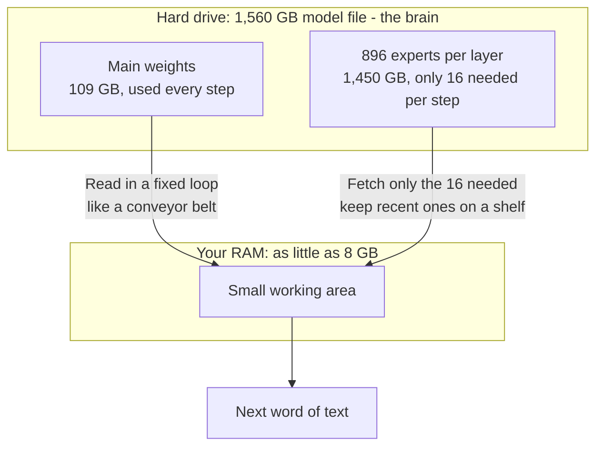
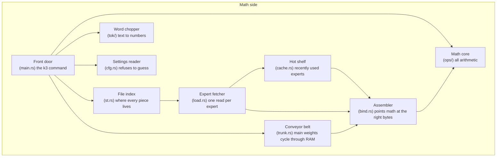
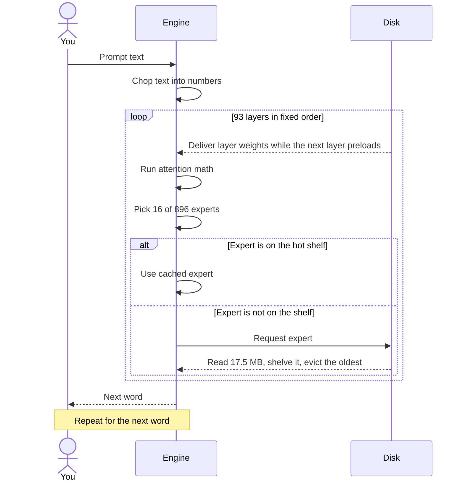
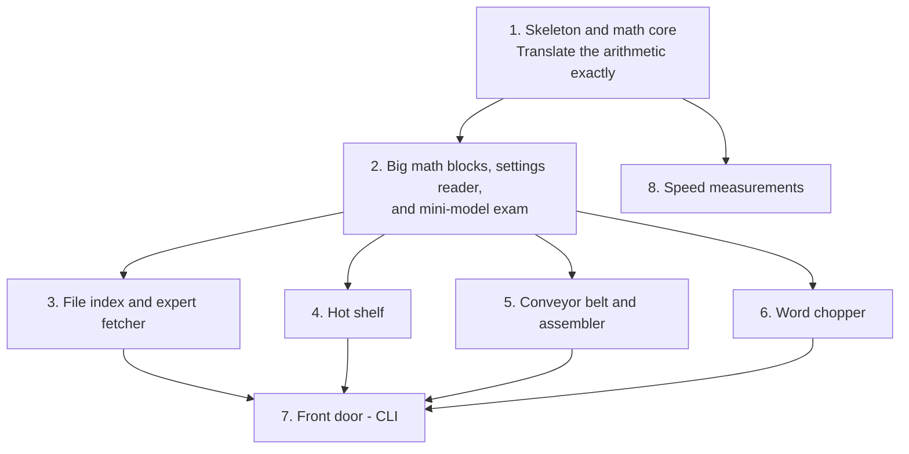
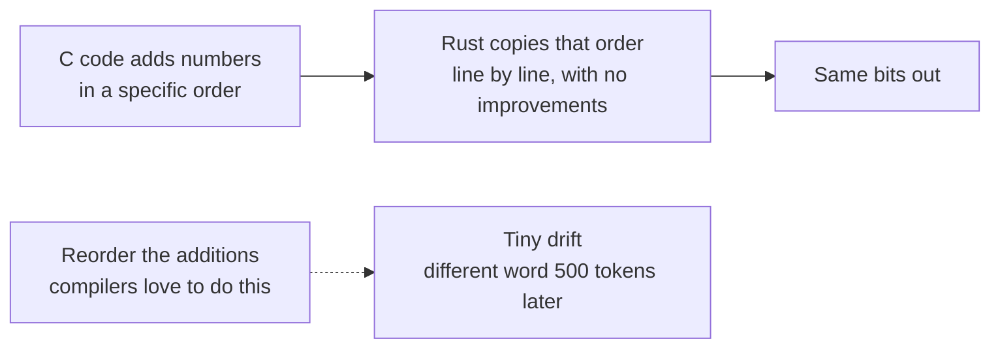
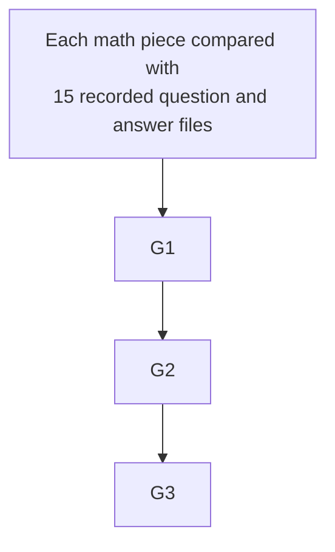

# Kimi-K3 in Rust - Flow

## 1. What this program even is

Trick: never hold the whole brain in RAM.
More RAM makes it faster, never different.
The same prompt produces the same answer on an 8 GB laptop and a 224 GB server, byte for byte.
That promise is the whole project.

## 2. The parts (C file to Rust module, plain names)

## 3. One word generated, start to finish

## 4. Build order (the 8 steps in the plan)

Steps 3 through 6 are independent and can happen in any order.
Each step ships with its own tests passing.

## 5. Why exactly the same answer is hard, and the rule that fixes it

Floating-point math means `(a + b) + c` is not always equal to `a + (b + c)` in the last digit.
The C code pins the order.
The Rust translation table pins the identical order, line by line.
Fast SIMD paths must preserve that order too.

## 6. How we know it worked (proof ladder)

